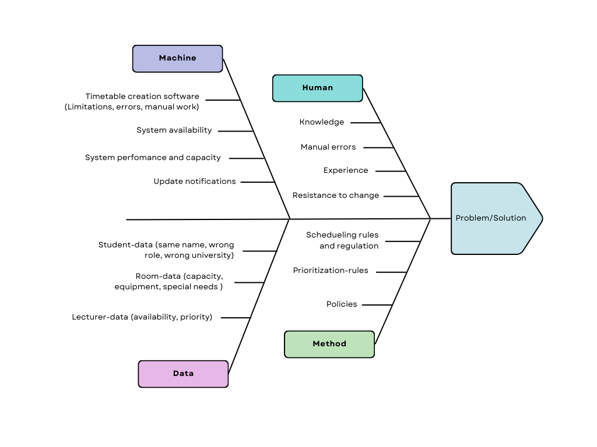
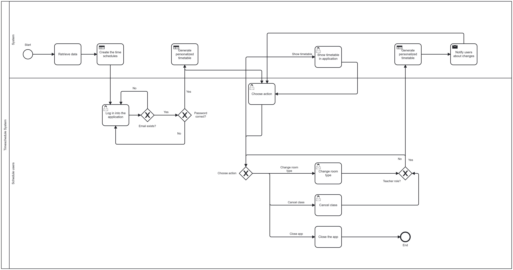

# 📑 Cover Page
- **Group Number**: Group 3
- **Student Names**: Melisa Avci, Raphael Tam-Dao, Victor Wilhelmsen, Shehab Wael Abozied Abdelhamed, Aleksandra Wos
- **Course**: DevOps and Low-Code Development
- **Date**: 2025-09-18

---

# Introduction
## Purpose of the Report 
This report establishes the foundation for a Business Information System (BIS) designed to revolutionize university timetable scheduling. By utilizing Business Process Modeling (BPMN) and Lean analysis, we identify inefficiencies in the current manual scheduling processes. The purpose is to analyze these real-world problems using BIS concepts and propose an automated, data-driven system design that will subsequently be modeled and executed in Camunda and Power Apps.

## Structure 
*   **Section 1: Problem Statement & Context.** We define the core scheduling challenges, identify the key stakeholders—specifically the schedulers, professors, and students—and explain the raw data captured. This is linked to the Data-Information-Knowledge-Wisdom (DIKW) hierarchy to demonstrate how raw inputs are transformed into scheduling solutions.
*   **Section 2: Theoretical Alignment.** This section classifies the proposed solution within the types of Business Information Systems (TPS, MIS, DSS). We analyze the nature of the change—focusing on Operational and Managerial improvements—and further apply the DIKW framework.
*   **Section 3: Business Process Analysis.** We detail the **AS-IS** (current) process, highlighting weaknesses through a Lean perspective and a Root Cause Analysis (Ishikawa Diagram). We then define the **TO-BE** (future) process, describing the step-by-step automated workflow that replaces manual efforts.
*   **Section 4: AI Collaboration.** This section documents our use of AI tools for brainstorming and refinement, including a reflection on the limitations encountered.
*   **Section 5: References.** Contains all references.

---

# Problem Statement & Context
## Problem Description 
Universities and their students face significant challenges in the process of schedule creation. 

The current system often relies on manual management, which makes it both inefficient and time-consuming. This results in timetables that are frequently unoptimized and prone to course clashes, especially when students select multiple electives or cross-program courses. This overlap reduces flexibility and limits opportunities for students who want to combine courses from different programs. 

Limited room availability and capacity are an additional problem, as the assigned room is often too small to accommodate the number of enrolled students. 

Communication issues further complicate the situation: delays and last-minute changes often prevent updates from reaching students and professors in time, leading to confusion. When a room suddenly becomes unavailable, a professor cancels a class, or a new course is added late, making adjustments without creating ripple effects throughout the timetable is particularly difficult. 

Another problem lies in the outdated tools many universities still rely on, such as slow and error-prone Excel files or even paper-based scheduling.

## Stakeholders 
The stakeholders involved and their core expectations are clearly defined by their role in or reliance on the scheduling process:
  - __Timetable Schedulers/Staff (Primary Users)__: 
  They are the core users whose existing manual workflow is directly targeted for replacement. They expect a significant  reduction in manual work and less time expenditure. They rely on the system to efficiently handle the complex task of minimizing clashes and assigning resources automatically.
  - __Professors__: They expect respect of their availability and automatically updated schedules in cases such as cancelled classes. They also require an automatic real-time notification system for any changes.
  - __Students__: They expect transparency and fairness with as few collisions as possible. They also expect a system that automatically updates schedules and provides real-time notifications for schedule or class changes.

## BIS Relevance
The individuals currently creating timetables often lack specialized IT expertise and are trained only to maintain the status quo using legacy tools. The problem is not a lack of effort, but a lack of **tool capability**. The current process captures raw data (course lists, room numbers), but fails to efficiently process it into useful information. By introducing a BIS, we bridge the gap between raw data availability and actionable scheduling wisdom, utilizing algorithms to perform tasks that are currently done manually.

---

# Theoretical Alignment
## BIS Classification
Our proposed solution integrates features from three distinct types of information systems:

*   **Transaction Processing System (TPS):** The core of the system handles routine, day-to-day transactions. This includes the automatic validation of user logins, the recording of room bookings, and the instant transmission of notifications when a class status changes.
*   **Management Information System (MIS):** The system summarizes data to help stakeholders monitor operations. It provides schedulers and administrators with structured overviews of room utilization rates, course density, and professor availability, ensuring that operations stay on track.
*   **Decision Support System (DSS):** This is the optimization engine. The system uses an algorithm to analyze variables and suggest the best possible timetable slots to minimize conflicts. It supports the schedulers in making complex decisions about resource allocation.

## DIKW Framework
To understand how our system adds value, we apply the Data-Information-Knowledge-Wisdom (DIKW) hierarchy. This framework demonstrates how the system transforms raw, disconnected facts into optimized scheduling decisions that solve the core business problem.

*   **Data (The Raw Inputs):**
    At the base level, the system captures discrete, unorganized facts and figures. In the current manual process, this data is often scattered across emails and excel sheets. Our system centralizes:
    *   **Entities:** Student IDs, Professor names, Room numbers, and Course codes.
    *   **Attributes:** Room capacity (e.g., "50 seats"), specific equipment attributes (e.g., "Projector," "Wheelchair accessible"), and time variables (e.g., 08:00–16:00 time slots).
    *   **Enrollment Metrics:** The specific number of students registered for each course.
    *   *Relevance:* Without context, this is just a collection of numbers and strings that provides no insight into the scheduling conflicts.

*   **Information (The Context):**
    By processing and structuring the data, the system answers "Who, What, Where, and When." It gives the raw data meaning and context.
    *   **Contextualization:** The system links specific professors to specific courses and rooms to their capacities.
    *   **Visibility:** We can now see: *"Course A has 60 students,"* *"Room 101 only holds 40 people,"* or *"Professor Smith is unavailable on Mondays."*
    *   *Relevance:* This stage allows the Scheduler to see the current state of resources. It highlights the requirements but does not yet solve the conflicts; it merely presents the facts in a readable format (e.g., a list of courses requiring labs).

*   **Knowledge (The Rules & Logic):**
    Knowledge is the application of rules, patterns, and logic to the information. It is the understanding of *how* different data points interact and constrain one another.
    *   **Constraint Logic:** The system understands that *"Course A cannot be placed in Room 101 because 60 > 40."*
    *   **Conflict Detection:** It identifies relationships, such as *"Student Group B cannot have two lectures at the same time,"* or *"A professor cannot be in two locations simultaneously."*
    *   **Regulatory Rules:** It applies university policies, such as ensuring break times between classes or prioritizing accessibility-compliant rooms for students with disabilities.
    *   *Relevance:* This is where the system identifies problems. It moves beyond just listing availability to understanding *why* a certain schedule configuration will fail.

*   **Wisdom (The Optimization & Action):**
    Wisdom represents the strategic application of knowledge to achieve the best possible outcome. In our BIS, this is the algorithmic optimization and the decision-making capability.
    *   **Optimization:** The system doesn't just identify a clash (Knowledge); it calculates the *best* alternative. It answers: *"What is the most efficient way to arrange 500 courses to minimize student gaps and maximize room usage?"*
    *   **Strategic Agility:** If a room becomes unavailable effectively immediately (e.g., a maintenance issue), the system applies wisdom to automatically reshuffle affected classes with minimal ripple effects, rather than just cancelling them.
    *   **Fairness:** It ensures that the schedule is equitable, balancing the preferences of professors with the educational needs of students.
    *   *Relevance:* This is the ultimate goal of the project. It transforms the Scheduler’s role from a "data entry clerk" to a "decision manager," allowing the university to operate with higher efficiency and student satisfaction.

*   **Nature of Change:**
Implementing this system represents a significant **Operational and Managerial Change**.

    *   **Operational Change:** The daily workflow shifts from manual data entry and cross-referencing spreadsheets to automated data retrieval and algorithmic sorting. Tasks that previously took weeks (manual conflict checking) will now take minutes.
    *   **Managerial Change:** The role of the "Timetable Scheduler" evolves from a data entry role to a supervisory role. Instead of building the schedule, they manage the parameters of the algorithm. This shifts the organizational focus from *maintenance* (keeping the schedule running) to *optimization* (improving the quality of education delivery). While this does not necessarily remove the department, it fundamentally changes *how* the department creates value.

---

# Business Process Analysis
## AS-IS Description
The AS-IS process contains inefficiencies, redundancies, and manual work. At our university, the process is as follows: 

The school (timetable maker) sends information to the professors, informing them that the class information for the next semester must be submitted by a given date. After this, the school collects data from the courses in the “Felles studentsystem” and transfers it to their own timetable system, called “TP”. Next, they group students based on their department and try to minimize scheduling clashes. 

Once they receive the class information, they begin planning the timetables. Some parts of this process are done manually, while others are handled automatically. Lectures can only be scheduled between 8 a.m. and 4 p.m. Students with special needs are given priority—for example, ensuring that the room is wheelchair accessible. After this, external professors are assigned to their preferred times. The timetables are then created in order: first-year students first, followed by second- and third-year students. The allocation of rooms depends on several factors, such as class size and whether a specialized room is required.

However, at other universities, the system might not be as efficient. There may be even more manual work if the university does not have the resources for a robust system. For example, timetables might be created in Excel, with no systematic comparison across courses, leading to conflicts between courses, rooms, and even professors.

## TO-BE Description
The **TO-BE** process focuses on automation and role-based data handling. The workflow proceeds as follows:

1.  **Data Retrieval:** The system automatically fetches course, student, and room data from the university's central database. No manual entry is required by the scheduler.
2.  **Algorithmic Generation:** The Scheduler initiates the optimization engine. The system evaluates constraints (room capacity, professor availability, student groups) and generates a clash-free timetable draft.
3.  **Validation & Publication:** The Scheduler reviews the draft. If valid, the schedule is published instantly to the application.
4.  **User Access:**
    *   **Students** log in via university SSO. The system filters data to show *only* their specific courses.
    *   **Professors** log in to view their teaching schedule.
5.  **Dynamic Management:**
    *   If a **Professor** needs to cancel a class or change a room, they select the option in the app.
    *   The system checks availability in real-time. If a room change is requested, the system suggests only available rooms with the necessary equipment.
    *   Upon confirmation, the system updates the database immediately.
6.  **Automated Notification:** All affected students receive an instant push notification regarding the change, eliminating communication delays.

## Ishikawa Diagram (Root Cause Analysis)  

To understand the underlying causes of **Scheduling Conflicts & Inefficiencies**, we applied a Root Cause Analysis using the Ishikawa (Fishbone) diagram. As illustrated in the diagram below, we categorized the causes into **Machine, Method, Human, and Data**.

*Figure 1: Ishikawa Diagram illustrating the root causes of scheduling inefficiencies.*

**1. Machine (Technology & Tools)**
The technological infrastructure often hinders rather than helps the process.
*   **Lack of Automation:** The most critical failure is the **lack of automatic conflict detection**. The system does not alert users in real-time when a room is double-booked.
*   **System Fragmentation:** There are synchronization errors between systems, leading to discrepancies. Furthermore, the system does not update in real-time, forcing schedulers to rely on non-validated tools like **Excel spreadsheets or paper notes**, which removes the "single source of truth."
*   **Software Limitations:** The current software has limited support for special cases (e.g., specific accessibility needs), requiring manual workarounds.

**2. Method (Process & Policies)**
Even with perfect tools, the current workflow contains procedural flaws.
*   **Manual Data Transfer:** A major bottleneck is the manual transfer of data between the "Felles Studentsystem" (FS) and the scheduling system (TP). This manual step is slow and introduces transcription errors.
*   **Lack of Standardization:** There is **no standardized process for change requests**, and rules for prioritizing conflicts are unclear. For example, there is a lack of priority in room booking, leading to "first-come-first-served" issues rather than "need-based" allocation.
*   **Planning Sequence:** There is an incorrect sequence in the planning process, specifically the **absence of a "lock-in" period** before the semester starts. This allows changes to happen too close to the deadline, causing chaos.

**3. Data (Information Quality)**
Reliable scheduling is impossible without accurate input ("Garbage In, Garbage Out").
*   **Incomplete Attributes:** Critical information is often missing, such as specific **equipment requirements** (e.g., projectors, lab tools) or correct **room capacities**.
*   **Outdated Information:** The schedulers frequently work with outdated student lists or incorrect teacher availability data, leading to schedules that work in theory but fail in reality.

**4. Human (People & Culture)**
Human factors introduce variability and error into the system.
*   **Behavioral Delays:** Professors frequently submit their requirements late, forcing schedulers to rush the planning phase.
*   **Manual Errors:** Due to fatigue or lack of oversight, administrators often overlook conflict alerts or make manual entry errors.
*   **Training & Resistance:** There is insufficient training on the system, particularly for temporary staff who are unfamiliar with procedures. Additionally, there is a general **resistance to change**, keeping the university locked in inefficient manual habits.

## BPMN Diagram 
Our BPMN diagram begins with the task “Retrieve data”. Since we do not have an actual database connected, we modeled this as a standard task instead of an SQL task. The next step uses a DMN table filled with dummy data to create the time schedule.

After this, the login process starts. Two exclusive gateways check whether the email exists in the data and whether the password is correct. For our demonstration, we used dummy login data: Email: “a@hiof.de” and password: “12345”. Only with these credentials can the professor log in successfully.

Once logged in, the system generates a personalized timetable from the dummy DMN data. At this point, the professor can choose between different actions. Possible actions include:
- Change room type (restricted to users with the teacher role)
- Cancel class (restricted to users with the teacher role)
- Show timetable in application (available to all users)
- Close the app (available to all users)

The teacher role is verified through an additional gateway to ensure that only professors can modify room types or cancel classes by inputting it in taskforms. These modifications trigger the system to regenerate the timetable and notify users about the changes. Afterwards, the process returns to the “Choose action” task, allowing the professor to continue with further actions.

We decided to model “Show timetable in application” as a user task, even though the system performs the action, because we wanted it to represent the visualization step in the process.

The process ends when the user selects the action “Close the app.”

---

# AI Collaboration

### Prompt Log

1.  **Prompt:** "Give me business or organizational settings where a workflow or process can be improved by a BIS (Data-oriented app). Examples: construction project document hub, facility maintenance..."
    *   **Utility:** Helped identify diverse use cases before settling on university scheduling.
2.  **Prompt:** "You are a scheduler from a university and we were thinking about the problems you’re probably facing... Is there anything you would add to it?"
    *   **Utility:** Expanded our understanding of the problem space, specifically highlighting "Resource Allocation" and "Communication Delays" beyond just scheduling clashes.
3.  **Prompt:** "You are the most inefficient time scheduler... what tools do you use that make it so inefficient?"
    *   **Utility:** Provided a creative "anti-persona" that helped us clearly define the AS-IS problems (e.g., sticky notes, whiteboard scheduling).

***

### Outputs

1.  **Output:** Here’s a list of business or organizational settings where a Business Information System (BIS) / data-oriented app could significantly improve workflows or processes:

    *   **📂 Document & Information Management**
        *   Legal firms → Case file management, legal document versioning, compliance tracking.
        *   Research institutions → Centralized research data hub for collaboration, experiment tracking, and versioned datasets.
        *   Publishing companies → Manuscript submission and review workflows.

    *   **🏗️ Operations & Logistics**
        *   Construction companies → Construction project document hub (your example), equipment scheduling, and safety inspection reporting.
        *   Logistics & transportation → Fleet tracking, route optimization, cargo documentation.
        *   Warehousing → Inventory tracking, restocking workflows, real-time demand dashboards.

    *   **🏥 Healthcare & Social Services**
        *   Hospitals/clinics → Patient record case management, staff scheduling, treatment tracking.
        *   Public health departments → Vaccination campaign registration and monitoring.
        *   Non-profits/NGOs → Case tracking for aid distribution, donor data management.

    *   **🎓 Education & Campus Life**
        *   Universities → Student event registration (your example), course registration optimization, exam room scheduling.
        *   Training organizations → Learning management system for certification and skills tracking.
        *   Research labs → Lab equipment booking, experiment logs, safety protocol tracking.

    *   **🏢 Corporate/HR**
        *   Human resources → Employee onboarding, leave requests, performance reviews.
        *   Recruitment agencies → Candidate pipeline management, interview scheduling.
        *   Consulting firms → Project resource allocation and deliverable tracking.

    *   **🏬 Customer-Facing Services**
        *   Hospitality → Hotel facility maintenance (your example), guest request tracking, room service workflows.
        *   Retail → Returns/exchange management, loyalty program data tracking, supply chain analytics.
        *   Event management companies → Ticketing, vendor coordination, volunteer scheduling.

    *   **⚙️ Government & Public Sector**
        *   Municipal services → Permit applications, building inspections, citizen issue reporting (e.g., potholes, broken streetlights).
        *   Courts → Case assignment, evidence tracking, scheduling of hearings.
        *   Libraries/archives → Digital cataloguing, lending management, research requests.

    *   **👉 A useful heuristic:**
        *   A BIS is especially powerful where there are repetitive, data-heavy processes with multiple stakeholders (documents, approvals, scheduling, compliance, case tracking).

    *   **Internal Business Operations**
        *   Procurement departments → Supplier database, purchase orders, and contract renewal tracking.
        *   Accounting firms → Client invoice hub, tax document workflow, expense reimbursement tracking.
        *   IT departments → Asset inventory, incident/ticketing system, license renewals.
        *   R&D divisions → Idea submission and evaluation pipeline, patent documentation management.

    *   **🏥 Healthcare & Wellness**
        *   Mental health clinics → Client intake forms, therapy progress tracking, case notes.
        *   Pharmacies → Prescription management, drug stock tracking, regulatory compliance reporting.
        *   Fitness centers → Member management, trainer schedules, class registration, performance data.

    *   **🎓 Education & Training**
        *   K-12 schools → Parent-teacher meeting scheduler, student attendance/behavior dashboard.
        *   Universities → Thesis submission and review workflows, lab equipment booking system.
        *   Corporate training → Certification progress tracker, mandatory compliance training hub.

    *   **🏗️ Field Services & Maintenance**
        *   Utilities companies → Maintenance scheduling (pipes, power lines, meters), outage tracking.
        *   Real estate/property managers → Tenant request system, rent collection dashboards, maintenance logs.
        *   Cleaning/janitorial services → Task assignment, inspection reports, supply inventory.

    *   **🚚 Logistics & Supply Chain**
        *   Import/export companies → Customs document tracking, shipment compliance.
        *   Food distributors → Expiry date tracking, supplier audits, delivery routing.
        *   E-commerce fulfillment → Order processing workflow, returns/exchange hub.

    *   **🎭 Events & Community**
        *   Conference organizers → Attendee registration, session scheduling, speaker submissions.
        *   Sports clubs → Player availability, training attendance, match statistics tracking.
        *   Non-profits/volunteer groups → Volunteer shift management, donation/event tracking.

    *   **⚖️ Government & Civic Services**
        *   Police departments → Case management, evidence chain-of-custody, officer scheduling.
        *   City planning offices → Zoning application workflows, land use data management.
        *   Public libraries → Special event registrations, rare book/archive lending requests.

    *   **🌱 Specialized & Niche**
        *   Museums → Collection inventory, loan/borrowing agreements, exhibit scheduling.
        *   Farms/agriculture → Crop yield tracking, equipment usage logs, pesticide application records.
        *   Labs/biotech → Sample tracking, experiment workflow automation, compliance logs.
        *   Environmental NGOs → Wildlife sightings data collection, conservation project tracking.

    *   **👉 The common thread:**
        *   Anywhere with recurring requests, approvals, scheduling, or regulated documentation → a BIS can replace messy spreadsheets and email threads.
        *   *Would you like me to turn this into a master list of 30–40 BIS app scenarios, each with: Core process (what it improves), Key entities/data (what’s stored), Workflow example (how it runs)? That way, you’d have a catalog of use cases ready for inspiration or project pitching.*

2.  **Output:** Yes 👌 You’re already hitting the core pain points. If I put myself in the shoes of a university scheduler, I’d add a few more problems that usually come up:

    *   **✅ Additional Problems**
        *   **Room availability & capacity limits** → Sometimes two classes are scheduled in the same room, or a room is too small for the enrolled students.
        *   **Professor availability** → Professors may be double-booked, or schedules ignore their teaching preferences/office hours.
        *   **Last-minute changes** → When a professor cancels, a room becomes unavailable, or a course is added late, it’s hard to update the schedule without causing ripple effects.
        *   **Different student groups** → Electives and cross-program courses often overlap, making it hard for students who want to take both.
        *   **Manual processes** → Many universities still rely on Excel or even paper-based scheduling, which is slow and error-prone.
        *   **Exam scheduling conflicts** → Students may have two exams at the same time or multiple exams in one day.
        *   **Communication delays** → Even when the schedule is finalized, updates may not reach students and professors quickly (leading to confusion).
        *   **Resource allocation** → Some courses need special equipment (labs, projectors), and those rooms may not be managed efficiently.

    > **👉 So, in short:** it’s not just about clashes — it’s also about resources, fairness, last-minute changes, and communication.

3.  **Output:** If I were the most inefficient university time scheduler, my “tools” and methods would be the exact opposite of what good scheduling software or practices use. Here’s what would make me terrible at it:

    *   **Inefficient Tools & Practices**
        *   **Paper and Sticky Notes:** Using scraps of paper and sticky notes instead of a proper system. Notes fall off, get lost, or overlap, so no one knows when their class really is.
        *   **Excel with No Structure:** A giant, unformatted spreadsheet with random colors, merged cells, and no filters. No validation to prevent double-bookings. Professors and rooms typed inconsistently (“Dr. Smith” in one cell, “Smith, Dr.” in another).
        *   **Email Chains & Word Docs:** Asking each lecturer to send their availability in long email threads. Copy-pasting conflicting schedules into Word tables with no automatic conflict detection.
        *   **Whiteboard Erased Daily:** Writing all classes on a whiteboard with no backup. Someone erases a section, and suddenly three classes are missing from the schedule.
        *   **Random Number Generator:** Assigning times and rooms based on dice rolls, coin flips, or a randomizer app. Leads to classes overlapping, being scheduled at 3 a.m., or crammed into broom closets.
        *   **Outdated Software:** Using an ancient DOS program from the 1980s that only runs on one old PC. Requires manual re-entry for every tiny change, with no undo function.
        *   **Manual Wall Calendar:** Filling in a giant wall calendar by hand, and every time a change is made, crossing things out until the page is unreadable. Result: impossible to tell which schedule is current.
        *   **No Centralized Database:** Each department keeps their own schedule in different formats (Word, Excel, Google Docs). No one compares them, so conflicts between courses, rooms, and professors are guaranteed.

***

### Reflection
We've used ChatGPT for brainstorming. Furthermore, we tried to get some help from the AI while working with Camunda Modeler but it wasn't helpful. We tried not to use that much AI, so we could decide on our own how the system should work, resulting in a bigger learning process. Though ChatGPT helped us by getting ideas or the perspective of different roles.

For example, we've used it to tell us what tools could use some improvements or rework out of the scheduler's point of view who is using a less efficient system. The knowledge he gave us was something we didn't have so we either get it from the experience of our scheduler or the AI.

Because we've already talked to our university about it we only knew about one way to do the creation of the time schedules. ChatGPT on the other hand extended our perspective by adding different scenarios to it. In our case we found out that using the AI is useful for general questions but the AI struggles in more specific scenarios for example in the case of Camunda Modeler it was not able to give us clear structured answers.

---

# References
*   ProcessMaker by Larissa Lewis (2020, November 2). *Decision model and notation tutorial | DMN examples.* ProcessMaker. [ProcessMaker](https://www.processmaker.com/blog/decision-model-and-notation-dmn-tutorial-examples/)
*   FSAT. (n.d.). *Felles studentsystem (FS) – English pages.* Felles studentsystem. [FSAT.](https://www.fellesstudentsystem.no/english/index.html)
*   Wikipedia contributors. (2023, December 30). *Student information system.* Wikipedia. [Wikipedia](https://en.wikipedia.org/wiki/Student_information_system)
*   Camunda. (2025, January 29). *BPMN Gateways and How to Use Them in Camunda* [Video](https://youtu.be/yfOXFGlMKjI) 
*   Camunda. (2021, Juli 01). *Camunda Platform 7 Tutorial: Building a Process and Adding Forms in Camunda Run* [Video](https://youtu.be/J_ut6-7GUkQ) 
*  TEKKY TALKS. (2023, January 29). *Adding form to user task - Camunda 8 - Camunda BPMN* [Video](https://youtu.be/iAbzQSeAgIU)
*   DecisionSkills. (2014, November 10). *How to Solve a Problem in Four Steps: The IDEA Model* [Video](https://www.youtube.com/watch?v=QOjTJAFyNrU&t)
*   i-nexus strategy software. (2018, May 25). *The Classic & Reverse Fishbone Diagram* [Video](https://www.youtube.com/watch?v=XinW5dwuKsI)
