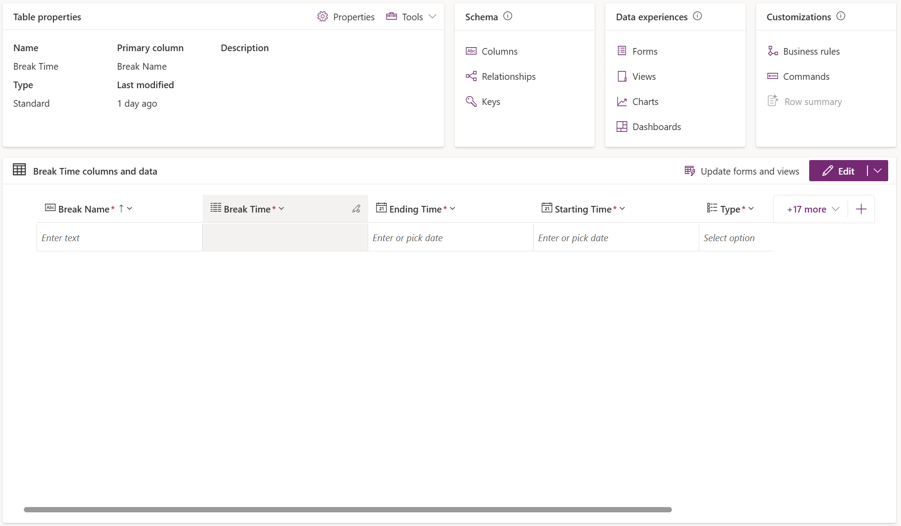
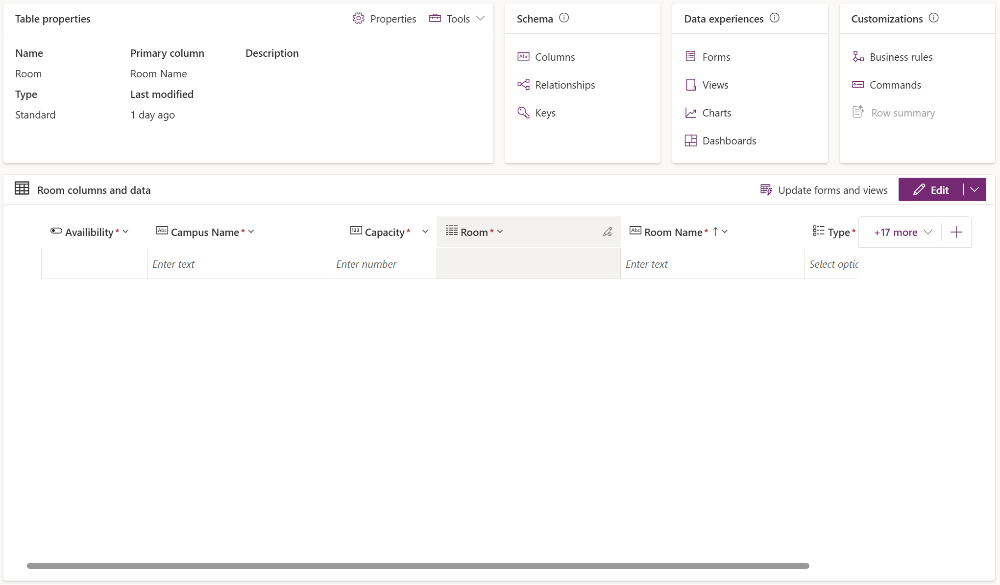

# Assignment 2 – From BPMN to Power Apps Prototype

## 1. Introduction
Which part(s) of the process are in scope for this prototype.  
Team roles and responsibilities (who did what).  

This prototype focuses on the Timeschedule System shown in the BPMN diagram.
It includes the following core process steps:
- Basic structur of the UI
- Logging into the system (authentication and role identification).
- Viewing the dummy timetable and dummy notification

The prototype implements the student/professor app interface—not the full scheduler back-end. The focus is on usability, accessibility, and data integration.

#### Team Roles and Responsibilities ####
- Melisa: UI creation in Power Apps (Timeschedule), Creation of the tables in Dataverse, Connecting the data to the Login and making it functionable
- Raphael: UI creation in Power Apps (Login, Notification), Navbar Component navigation
- Victor: UI creation in Power Apps (Navbar), Navbar Component navigation
- Aleksandra: UI creation in Power Apps (Notification)
- Shehab: UI creation in Power Apps (Profile)

Every group member paticipated in every group meeting and we've done the template all together.

## 2. Mapping BPMN → Features & Data
**Requirement Mapping Table**

| BPMN Requirement | Feature (UI/Screen) | Data Needed (Entity/Field) | Notes |
|------------------|----------------------|----------------------------|-------|
| R1: Retrieve data | System backend (Dataverse connection) | Course, Room, Person, OpeningHour, BreakingTime, Enrollment | We are putting dummy data in the dataverse table |
| R2: Generate personalized timetable | System backend | Course, Room, Person, OpeningHour, BreakingTime, Enrollment | Future implementation, Staff only |
| R3: Log in into the application | Log-in-screen | Person (Email, Password) | Authenticates user |
| R4: Show timetable in application | Timetable(Homescreen) | Course, Room, Person, OpeningHour, BreakingTime, Enrollment | Filtered by logged-in user |
| R5: Choose action | Profile screen | Person (Role) | Depending on their role |
| R6: Change room type | Profile screen | Person (Role), Room(Type, Capacity,Availability, Campus Name) | Professors only |
| R7: Cancel class | Profile screen | Person (Role), Course(Status) | Professors only |
| R8: Notify users about changes | Notification message in the navbar | Notification | UI element for future automation |
| R9: Log out of the application | Profile screen | Person(Status) | Future implementation |
| R10: Close the app | End of navigation flow | - | Process end condition |

Add a short paragraph explaining how BPMN elements were translated into app requirements.  

#### Explanation ####
Each BPMN task was converted into features that can be represented in Power Apps.
- User actions (e.g., login, choose action) became screens or buttons.
- System processes became data connections or background data sources.
- Notifications are visual placeholders for future Power Automate integration.

## 3. Development Plan (Manual, Inspired by Copilot Designer)
We've attached our Development Plan by the Copilot Designer in the assets folder.

### Scope
Define the MVP scope (which features/screens are included now).  
Features excluded (saved for future iterations/Assignment 3).  

#### In the current Scope ####
The MVP includes:
- Log-in screen
- Timetable screen with mocking data/fields
- User profile screen
- Basic navigation (menu, notification bell, user profile button)
- Mockup of notification pop-up

#### Out of Scope (Future Iterations) ####
- Actual timetable optimization algorithm
- Automated notification logic (Power Automate flow)
- Functionality of the actions in the profile (log out, change room, cancel class)
- Connecting the data to the whole application in every component so it matches the logged in user
- Use of algorithm as a staff member

### Iterations / Phases
- Iteration 1 (MVP): UI & Data Setup (Create screens, connect Dataverse tables, sample data)
- Iteration 2: Navigation & Galleries (Add functional navigation)
- Iteration 3 (future): Automations, role-based screens (Add Power Automate notifications, role-based logic)

### Backlog 
- [x] Log-in screen
- [x] Timetable screen with mocking data/fields 
- [x] User profile screen 
- [x] Basic navigation (menu, notification bell, user profile button)
- [x] Mockup of notification pop-up
- [ ] Actual timetable optimization algorithm
- [ ] Automated notification logic (Power Automate flow)
- [ ] Functionality of the actions in the profile (log out, change room, cancel class)
- [ ] Connecting the data to the whole application in every component so it matches the logged in user
- [ ] Use of algorithm as a staff member

## 4. Data Model
**Entities & Attributes Table**

## 5. App Prototype
### Screens Implemented
- Schedule screen: displays the timetable  
- Login screen: authenticates the user  
- Profile screen: displays user data and actions corresponding to their role 

### Reusable Components
Header Component: Navigation menu reused across screens with a notification pop-up alert UI placeholder.

### Data Connections

#### Data source used & Integration ####
- Dataverse tables (Person, Course, Enrollment, OpeningHour, Breaktime, Room)
- Dummy data used for login credentials and integrated them by comparing user inputs of the login with the existing data in the tables

#### Limitations/issues ####
- No real authentication or backend logic.
- Notifications not automated (mockup only).
- Performance depends on Dataverse data size.
- Creating relationships are limited with existing tables (in the Power Apps docs: “No new relationship can have any action set to Cascade All, Cascade Active, or Cascade User-Owned if the related table in that relationship already exists as a related table in another relationship that has any action set to Cascade All, Cascade Active, or Cascade User-Owned. This prevents relationships that create a multi-parent relationship.”).

## 6. Reflection & Lessons Learned
What worked well in the mapping → planning → prototype workflow?  
Biggest challenge faced (UI design, data binding, versioning, etc.).  
How GitHub was used (commits, exports, screenshots).  
Teamwork experience.  

#### What Worked Well ####
- Translating BPMN steps into app features gave a clear design direction.
- Power Apps allowed quick visualization of the process with minimal coding.
- Dataverse structure simplified the overview of the data.

#### Challenges ####
- Creating relationships in Dataverse with existing tables.
- Translating the timetable grid in a component with elements.
- Navigating with components.
- Using a form for the login.
- Collaboration in Power Apps.
- Working with variables in Power Apps.

#### GitHub Usage ####
We encountered an issue while updating our branch, so we had to continue working temporarily in Google Docs. After searching for solutions without success, we decided to manually add the updated assignment-02 file to the repository. We then pasted our finalized template into the new GitHub file and committed the changes together while everyone was present.

#### Teamwork experience ####
- Clear division of roles improved productivity.
- Collaboration tools like Power Apps co-editing were effective.
- Physical meetings improved communication and helped us support each other more effectively as a group.
