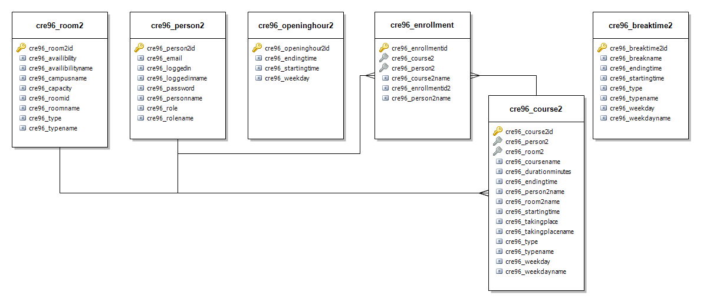
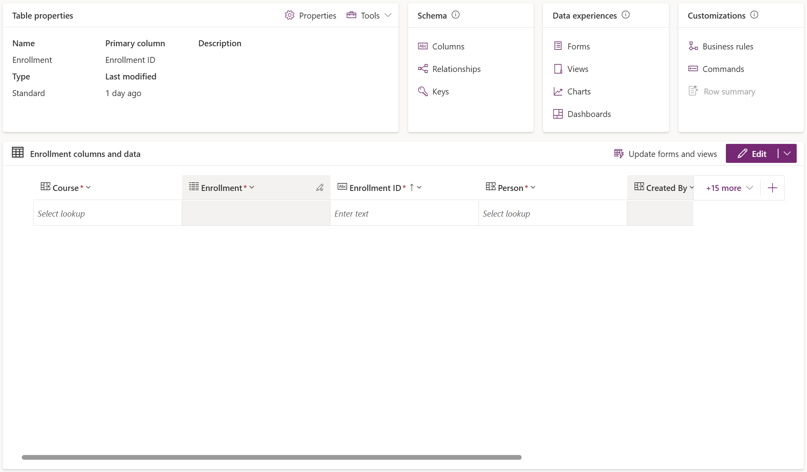
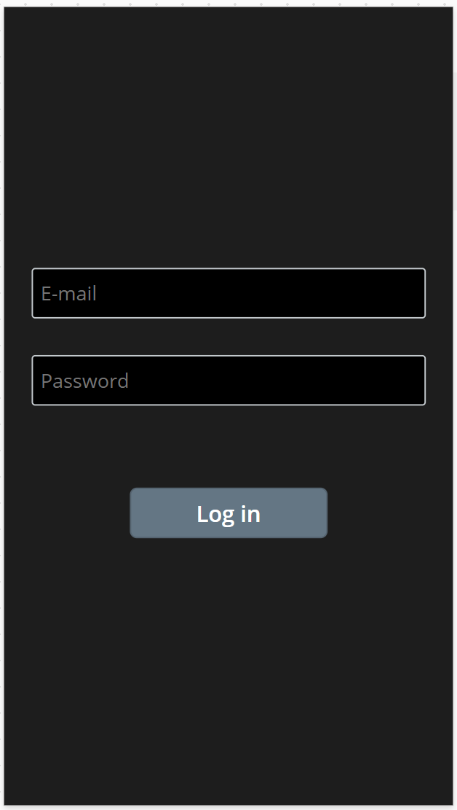
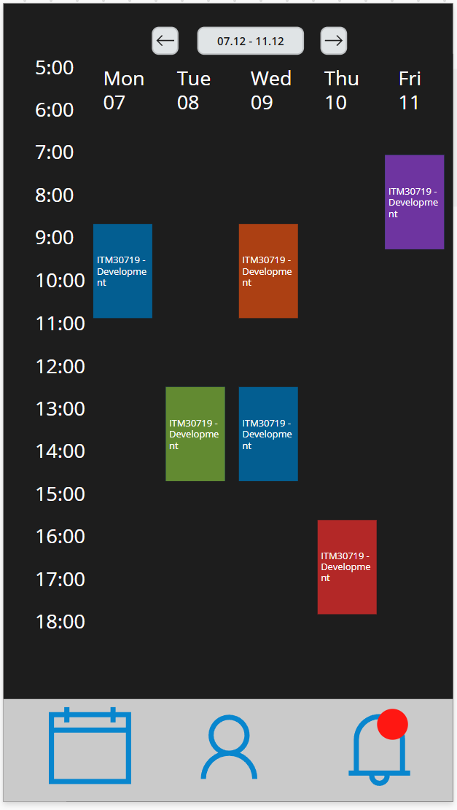
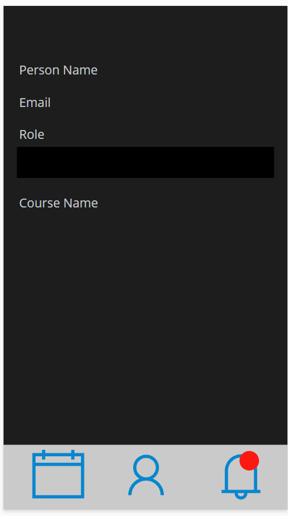
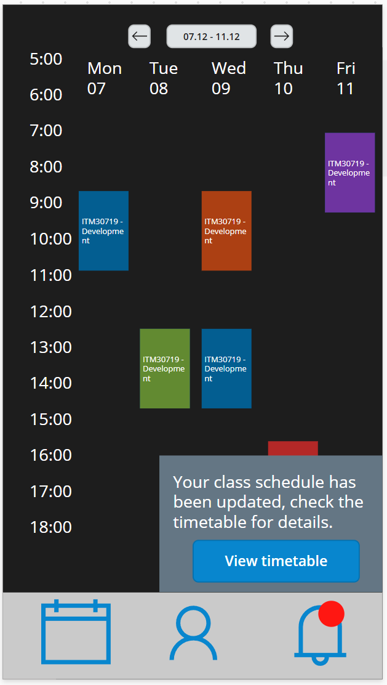

# Assignment 2 – From BPMN to Power Apps Prototype

## Introduction
This section outlines the translation of the business process modeled in Assignment 1 into a functional Low-Code prototype. The scope of this prototype focuses specifically on the **Timeschedule System** swimlane illustrated in the BPMN diagram.

The core process steps included in this MVP (Minimum Viable Product) are:
1.  **User Authentication:** Logging into the system with role identification.
2.  **Visualization:** Viewing the personalized dummy timetable.
3.  **User Interface Structure:** Establishing the basic navigation and layout.

The prototype implements the frontend interface for Students and Professors. It does not yet cover the full complex backend logic of the Scheduler (Staff) role. The primary focus of this iteration is usability, accessibility, and successful data integration.

#### Team Roles and Responsibilities ####
*   **Melisa:** UI creation in Power Apps (Timeschedule/Homescreen_1 and Login), Creation of the tables in Dataverse, Connecting the data to the Login-scren, Backend of the Login 
*   **Raphael:** UI creation in Power Apps (Login, Notification), Navbar Component navigation
*   **Victor:** UI creation in Power Apps (Navbar), Navbar Component navigation
*   **Aleksandra:** UI creation in Power Apps (Notification)
*   **Shehab:** UI creation in Power Apps (Profile)

## Mapping BPMN → Features & Data
**Requirement Mapping Table**
To bridge the gap between our process model and the application, we mapped specific BPMN requirements to tangible app features and data entities.

| BPMN Requirement | Feature (UI/Screen) | Data Needed (Entity/Field) | Notes |
|------------------|----------------------|----------------------------|-------|
| R1: Retrieve data | System backend (Dataverse connection) | Course, Room, Person, OpeningHour, BreakingTime, Enrollment | We are putting dummy data in the dataverse table |
| R2: Generate personalized timetable | System backend | Course, Room, Person, OpeningHour, BreakingTime, Enrollment | Future implementation, Staff only |
| R3: Log in into the application | Log-in-screen | Person (Email, Password) | Authenticates user |
| R4: Show timetable in application | Timetable(Homescreen) | Course, Room, Person, OpeningHour, BreakingTime, Enrollment | Filtered by logged-in user |
| R5: Choose action | Profile screen | Person (Role) | Depending on their role |
| R6: Change room type | Profile screen | Person (Role), Room(Type, Capacity,Availability, Campus Name) | Professors only |
| R7: Cancel class | Profile screen | Person (Role), Course(Status) | Professors only |
| R8: Notify users about changes | Notification message in the navbar | Notification | UI element for future automation |
| R9: Log out of the application | Profile screen | Person(Status) | Future implementation |
| R10: Close the app | End of navigation flow | - | Process end condition |

#### Explanation ####
Each task from our BPMN diagram was converted into a feature representable in Power Apps. User actions, such as logging in or choosing an action, were translated into specific screens or buttons. System processes, such as "Retrieve Data," became data connections or background data sources. Notification tasks were modeled as visual placeholders in the UI, preparing the ground for future Power Automate integration.

## Development Plan (Manual, Inspired by Copilot Designer)
We utilized the Copilot Designer to generate an initial development plan, which we then refined manually to fit our specific constraints. The full AI-generated plan is available in the project assets folder.

### Scope
For this assignment, we defined a specific scope to ensure a deliverable MVP.

#### In the current Scope (MVP) ####
The current prototype includes:
*   **Log-in Screen**
*   **Timetable Screen:** Displaying schedule blocks using mock data.
*   **User Profile Screen** 
*   **Navigation:** A reusable component (Menu, Notification bell, Profile button).
*   **Notifications:** A visual mockup of the notification pop-up.

**Out of Scope (Future Iterations)**
The following features are planned but not yet implemented:
*   The actual algorithmic optimization for timetable generation.
*   Fully automated notification logic via Power Automate.
*   Full functionality of profile actions (changing rooms, canceling classes).
*   Global data context connection across every single component.

### Iterations / Phases
This section outlines the planned development approach, breaking down the project into three distinct iterations or phases. The goal of this phased release is to deliver a Minimum Viable Product (MVP) first (Iteration 1), followed by feature enhancements and future functionality.
*   **Iteration 1 (MVP):** UI & Data Setup. This involved creating the blank screens, designing the Dataverse tables, and importing sample dummy data.
*   **Iteration 2:** Navigation & Galleries. We added functional navigation between screens and implemented galleries to display the data created in Iteration 1.
*   **Iteration 3 (Future):** Automations and Role-Based Logic. This phase will focus on connecting Power Automate flows for notifications and refining the security roles.

### Backlog 
This section lists all outstanding tasks and potential features for the application, categorized as either completed or in-progress (⊠) and planned for the future (□). It serves as the project's backlog, detailing items to be addressed in the current and subsequent development iterations.
The following list indicates the status of key deliverables for this assignment.
- [x] Log-in screen
- [x] Timetable screen with mocking data/fields 
- [x] User profile screen 
- [x] Basic navigation (menu, notification bell, user profile button)
- [x] Mockup of notification pop-up
- [ ] Actual timetable optimization algorithm
- [ ] Automated notification logic (Power Automate flow)
- [ ] Functionality of the actions in the profile (log out, change room, cancel class)
- [ ] Connecting the data to the whole application in every component so it matches the logged in user
- [ ] Use of algorithm as a staff member

## Data Model
We designed a relational data model in Microsoft Dataverse to support the application. Below is the structure of our entities and the Entity-Relationship (ER) diagram.

### Entity-Relationship Diagram

As illustrated in **Entity Relationship Diagram (ERD)**, it visualizes the structural logic and interconnectivity of our Dataverse solution. The model is designed to handle complex scheduling needs through relational links between users, academic resources, and time slots.

*Entity Relationship Diagram (ERD) showing the schema and relationships between Dataverse tables.*

The diagram highlights the following key relationships:

1.  **Student-Course Relationship (Many-to-Many):**
    Directly linking students to courses would result in data redundancy. Instead, we utilized a junction table, **`cre96_enrollment`**. This entity sits between **`cre96_person2`** (Student) and **`cre96_course2`** (Course), allowing one student to enroll in multiple courses and one course to have multiple enrolled students.

2.  **Professor-Course Relationship (One-to-Many):**
    The **`cre96_course2`** table contains a direct lookup field to **`cre96_person2`**. This establishes a relationship where a specific Professor (Person) is assigned as the lecturer for a Course.

3.  **Resource Allocation:**
    To manage physical space, the **`cre96_course2`** entity is linked to **`cre96_room2`**. This allows every course instance to be assigned a specific room, inheriting the room's attributes (such as Capacity and Campus Name) for validation purposes.

4.  **Static Reference Data:**
    Tables such as **`cre96_openinghour2`** and **`cre96_breaktime2`** exist as reference entities. While they may not have cascading foreign keys to every transaction, they are essential for the application's logic validation (e.g., preventing a course from being scheduled during a university break).

### Entities & Attributes Table
The following table details the specific columns created in Dataverse for this solution.

*Course table in Dataverse*

*Person table in Dataverse*

*Breaktime table in Dataverse*

*Enrollment table in Dataverse*

*Room table in Dataverse*

*Openinghours table in Dataverse*

## App Prototype
The prototype consists of three main screens designed for clarity and ease of use.

### Screens Implemented

1.  **Login Screen:**
    As shown in the figure below, this screen authenticates the user. It checks the input credentials (email and password) against the `Person` table in Dataverse.

    

    *Login Screen UI*

2.  **Schedule Screen (Homescreen):**
    Displayed below, this is the main landing page. It features a dynamic gallery that filters courses based on the logged-in user's ID, showing only the relevant timetable.

    

    *Schedule/Timetable UI*

3.  **Profile Screen:**
    As seen below, this screen displays the user's role and provides role-specific action buttons (e.g., "Cancel Class" for professors or "Change Room").

    

    *Profile Screen UI*

### Reusable Components
To ensure consistency, we created a **Header Component**. This navigation menu includes the notification bell and user profile button and is reused across all post-login screens.

**Notification Component:**
Shown in the figure below, the notification system appears as a pop-up overlay. Currently, this is a visual mockup to demonstrate how users will be alerted to schedule changes in the next iteration.

*Notification Pop-up UI*

### Data Connections

#### Data source used & Integration ####
The app connects directly to the Dataverse environment. We utilized dummy data for login credentials. When a user enters their email and password, the app performs a `LookUp` on the `Person` table. If a match is found, the user is navigated to the Timetable screen, and a global variable is set to define their context (Role, ID).

#### Limitations/issues ####
During development, we encountered specific limitations in the low-code environment.
1.  **No Real Authentication Logic:**
    *   *Limitation:* We are currently matching plain text strings from an input box against a Dataverse column. This is not secure.
    *   *Reason:* Setting up full Azure AD (Entra ID) authentication requires administrative privileges we do not have for this course scope.
    *   *Solution:* In a production environment, we would use the native "User" table in Dataverse and Azure Active Directory for secure, token-based authentication.
    
2.  **Notifications are Mockups:**
    *   *Limitation:* The notification bell shows a static alert; it does not update in real-time.
    *   *Reason:* Real-time push notifications require complex Power Automate flows which are part of the next assignment.
    *   *Solution:* We will implement a Power Automate flow in Assignment 3 that triggers an in-app notification when a record in the `Course` table is modified.

3.  **Relationship Constraints in Dataverse:**
    *   *Limitation:* Creating relationships are limited with existing tables (in the Power Apps docs: *“No new relationship can have any action set to Cascade All, Cascade Active, or Cascade User-Owned if the related table in that relationship already exists as a related table in another relationship that has any action set to Cascade All, Cascade Active, or Cascade User-Owned. This prevents relationships that create a multi-parent relationship.”*)
    *   *Reason:* This is a set limitation from microsoft.
    *   *Solution:* We adjusted the relationship behavior by recreating all of the excisting and new tables in a new take, so it was open for us to chose each relationship.

## Reflection & Lessons Learned

### What Worked Well
*   **BPMN as a Blueprint:** Translating the BPMN tasks directly into application features provided a definitive design direction. For example, the BPMN task "Log in" became a specific screen, and "Retrieve Data" became our Dataverse connection strategy. This ensured we didn't build unnecessary features (scope creep).
*   **Rapid Prototyping with Power Apps:** The low-code nature of Power Apps allowed us to visualize the process immediately. We could drag-and-drop UI elements to test the "look and feel" of the timetable without writing extensive CSS or HTML code.
*   **Dataverse Structure:** Using Dataverse as our backend simplified the data architecture. Unlike a traditional SQL setup, Dataverse provided a user-friendly interface to view relationships between `Person`, `Course`, and `Room`, making it easier to verify that our dummy data was correctly linked.

### Challenges
*   **Dataverse Relationship Constraints:** We encountered significant friction when creating relationships between existing tables. Specifically, we faced errors regarding "Cascade All" behaviors when a table was already part of another relationship. We had to learn to configure specific cascading behaviors to avoid multi-parent cycles.
*   **Timetable Grid Logic:** Translating a time-based schedule into a visual grid was complex. We had to calculate the exact X/Y coordinates for specific gallery items based on the `StartTime` and `Duration` fields, which required complex mathematical formulas in Power Apps.
*   **Component Navigation:** Implementing navigation through reusable components (like the Navbar) was difficult because components have a different scope than screens. Passing context (like the logged-in user) from a screen to a component required using custom properties.
*   **Collaboration Locks:** While Power Apps supports co-authoring, we frequently encountered "locking" issues where one person editing a specific screen prevented others from making changes to related logic, slowing down parallel development. Furthermore while working together on the same element for example by editing a formula it caused a lot of chaos.
*   **Variable Management:** managing the state of the application (e.g., `varUser`, `varShowPopup`) required careful planning. We struggled initially with understanding the difference between global variables (`Set`) and context variables (`UpdateContext`).

### GitHub Usage & Version Control
We utilized GitHub to version control our documentation and code artifacts, but we encountered a synchronization conflict.
*   **The Issue:** While attempting to update our feature branch with the latest changes, we faced a merge conflict that we could not resolve within the command line immediately.
*   **The Workaround:** To maintain momentum, we temporarily moved our documentation work to Google Docs to allow simultaneous editing without version conflicts.
*   **The Resolution:** Once the text was finalized, we manually added the updated `assignment-02.md` file to the repository. We then pasted our finalized content into the new file and performed a commit while the entire team was present, ensuring the submission reflected our collective work.

### Teamwork Experience
*   **Role Division:** We found that a clear division of roles (e.g., one person on Dataverse, one on UI Design, one on Logic) significantly improved productivity compared to everyone trying to do everything.
*   **Co-Editing Efficacy:** Despite the locking issues mentioned above, the collaboration tools in Power Apps were generally effective for building separate screens simultaneously.
*   **Importance of Physical Meetings:** We discovered that remote work was sufficient for documentation, but **physical meetings were essential for debugging**. When troubleshooting the complex timetable logic, sitting together around one screen allowed us to solve problems in minutes that took hours to address over chat.
