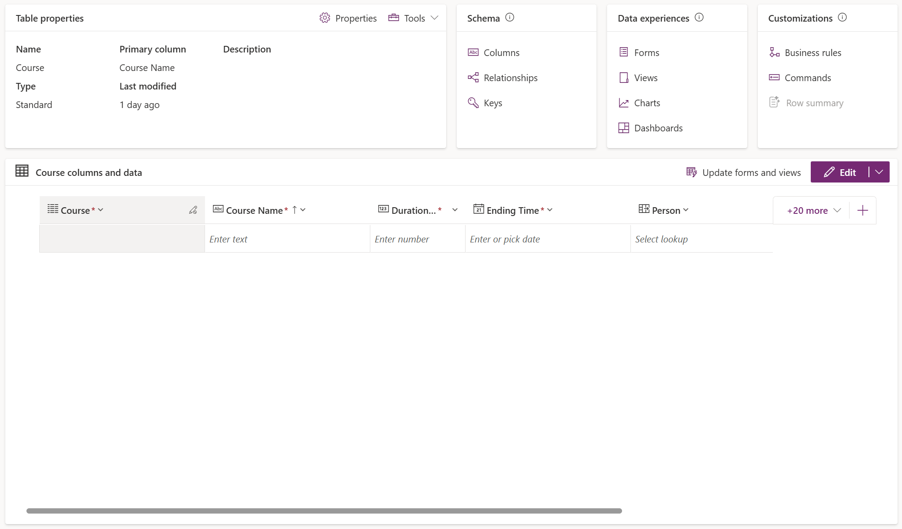
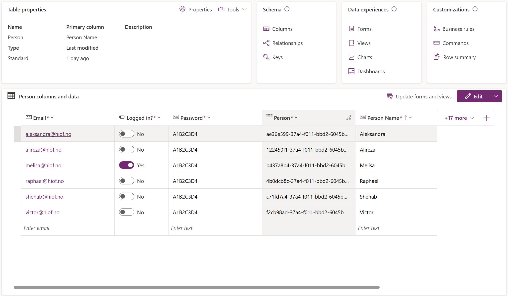
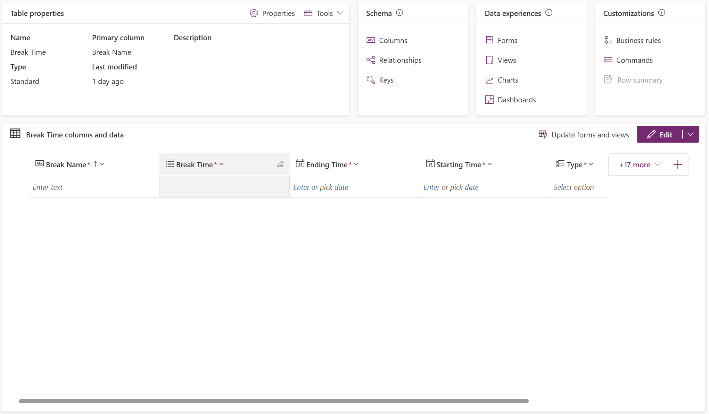
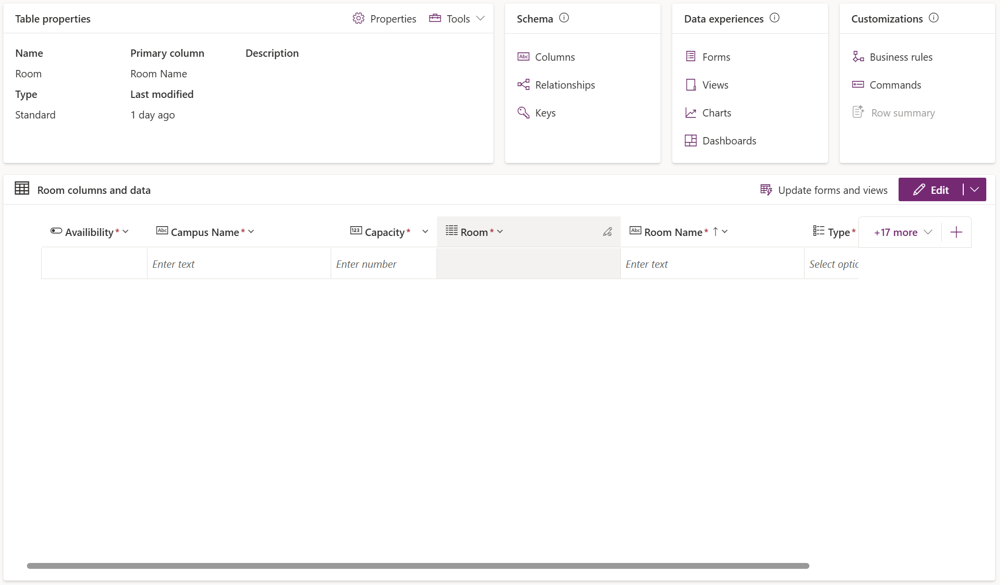
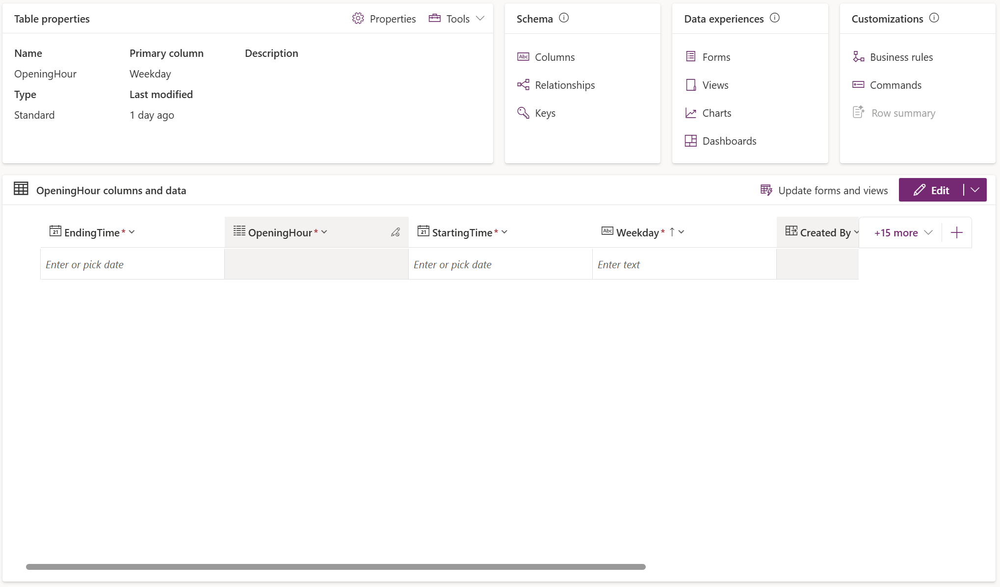

# Assignment 2 – From BPMN to Power Apps Prototype

## 1. Introduction
Which part(s) of the process are in scope for this prototype.  
Team roles and responsibilities (who did what).  

This prototype focuses on the Timeschedule System shown in the BPMN diagram.
It includes the following core process steps:
- Basic structur of the UI
- Logging into the system (authentication and role identification).
- Viewing the dummy timetable and dummy notification

The prototype implements the student/professor app interface—not the full scheduler back-end. The focus is on usability, accessibility, and data integration.

#### Team Roles and Responsibilities ####
- Melisa: UI creation in Power Apps (Timeschedule), Creation of the tables in Dataverse, Connecting the data to the Login and making it functionable
- Raphael: UI creation in Power Apps (Login, Notification), Navbar Component navigation
- Victor: UI creation in Power Apps (Navbar), Navbar Component navigation
- Aleksandra: UI creation in Power Apps (Notification)
- Shehab: UI creation in Power Apps (Profile)

Every group member paticipated in every group meeting and we've done the template all together.

## 2. Mapping BPMN → Features & Data
**Requirement Mapping Table**

| BPMN Requirement | Feature (UI/Screen) | Data Needed (Entity/Field) | Notes |
|------------------|----------------------|----------------------------|-------|
| R1: Retrieve data | System backend (Dataverse connection) | Course, Room, Person, OpeningHour, BreakingTime, Enrollment | We are putting dummy data in the dataverse table |
| R2: Generate personalized timetable | System backend | Course, Room, Person, OpeningHour, BreakingTime, Enrollment | Future implementation, Staff only |
| R3: Log in into the application | Log-in-screen | Person (Email, Password) | Authenticates user |
| R4: Show timetable in application | Timetable(Homescreen) | Course, Room, Person, OpeningHour, BreakingTime, Enrollment | Filtered by logged-in user |
| R5: Choose action | Profile screen | Person (Role) | Depending on their role |
| R6: Change room type | Profile screen | Person (Role), Room(Type, Capacity,Availability, Campus Name) | Professors only |
| R7: Cancel class | Profile screen | Person (Role), Course(Status) | Professors only |
| R8: Notify users about changes | Notification message in the navbar | Notification | UI element for future automation |
| R9: Log out of the application | Profile screen | Person(Status) | Future implementation |
| R10: Close the app | End of navigation flow | - | Process end condition |

Add a short paragraph explaining how BPMN elements were translated into app requirements.  

#### Explanation ####
Each BPMN task was converted into features that can be represented in Power Apps.
- User actions (e.g., login, choose action) became screens or buttons.
- System processes became data connections or background data sources.
- Notifications are visual placeholders for future Power Automate integration.

## 3. Development Plan (Manual, Inspired by Copilot Designer)
We've attached our Development Plan by the Copilot Designer in the assets folder.

### Scope
Define the MVP scope (which features/screens are included now).  
Features excluded (saved for future iterations/Assignment 3).  

#### In the current Scope ####
The MVP includes:
- Log-in screen
- Timetable screen with mocking data/fields
- User profile screen
- Basic navigation (menu, notification bell, user profile button)
- Mockup of notification pop-up

#### Out of Scope (Future Iterations) ####
- Actual timetable optimization algorithm
- Automated notification logic (Power Automate flow)
- Functionality of the actions in the profile (log out, change room, cancel class)
- Connecting the data to the whole application in every component so it matches the logged in user
- Use of algorithm as a staff member

### Iterations / Phases
- Iteration 1 (MVP): UI & Data Setup (Create screens, connect Dataverse tables, sample data)
- Iteration 2: Navigation & Galleries (Add functional navigation)
- Iteration 3 (future): Automations, role-based screens (Add Power Automate notifications, role-based logic)

### Backlog 
- [x] Log-in screen
- [x] Timetable screen with mocking data/fields 
- [x] User profile screen 
- [x] Basic navigation (menu, notification bell, user profile button)
- [x] Mockup of notification pop-up
- [ ] Actual timetable optimization algorithm
- [ ] Automated notification logic (Power Automate flow)
- [ ] Functionality of the actions in the profile (log out, change room, cancel class)
- [ ] Connecting the data to the whole application in every component so it matches the logged in user
- [ ] Use of algorithm as a staff member

## 4. Data Model
**Entities & Attributes Table**

## 5. App Prototype
### Screens Implemented
- Schedule screen: displays the timetable  
- Login screen: authenticates the user  
- Profile screen: displays user data and actions corresponding to their role 

### Reusable Components
Header Component: Navigation menu reused across screens with a notification pop-up alert UI placeholder.

### Data Connections

#### Data source used & Integration ####
- Dataverse tables (Person, Course, Enrollment, OpeningHour, Breaktime, Room)
- Dummy data used for login credentials and integrated them by comparing user inputs of the login with the existing data in the tables

#### Limitations/issues ####
| Limitation/Issue | Why It Is a Limitation |
|------------------|----------------------|
| No real authentication or backend logic.| This is a major security and functionality flaw. Authentication is necessary to verify user identity and ensure only authorized personnel can access or modify data. Backend logic handles complex, secure operations (like data validation, business rule enforcement, and complex calculations) that cannot be safely or efficiently performed directly on the client (app) side. Without it, the application is just a mock interface with no true security or robust data management.|
| Notifications not automated (mockup only).| Real-time business value is diminished. Notifications are crucial for user engagement, timely alerts (e.g., a task is overdue, a request was approved), and driving actions. If they are only mockups, users will not receive critical, automated information, making the app inefficient for process management. |
| Performance depends on Dataverse data size.| This is a scalability concern. As the amount of data stored in Dataverse increases (e.g., millions of records), the speed of retrieving, filtering, and updating that data directly within the app will slow down. This leads to a poor user experience (slow load times, lag) and can make the application unusable over time as the business grows. |
| Creating relationships are limited with existing tables (in the Power Apps docs: “No new relationship can have any action set to Cascade All, Cascade Active, or Cascade User-Owned if the related table in that relationship already exists as a related table in another relationship that has any action set to Cascade All, Cascade Active, or Cascade User-Owned. This prevents relationships that create a multi-parent relationship.”).| This is a structural constraint imposed by Dataverse's underlying relational database model to prevent cascading data corruption in multi-parent relationships (a form of a many-to-many constraint). Specifically, Dataverse prevents creating a new relationship with cascading delete/share/re-parent actions if the target table is already involved in another relationship with similar cascading actions. This restricts data model flexibility and can prevent implementing complex, nested business rules that require data cleanup across multiple linked tables.|

## Ways to Solve the Limitations ##
1. Real Authentication and Backend Logic
Authentication Solution:
- Leverage Platform Features: Use the built-in Power Platform security features (like Microsoft Entra ID (formerly Azure AD) integration) for user authentication and authorization.
- Custom Backend: For complex, secure logic, implement Custom APIs using Azure Functions or Azure App Service. These can run C# or Python code to execute business logic, validate data, and access external systems securely, completely separate from the Power App client.

2. Automated Notifications
Automation Platform: Use Power Automate (or Azure Logic Apps) to create automated, trigger-based flows.
- Example Flow: When a new record is created or an existing record's status changes in Dataverse, Power Automate can trigger an email, an in-app push notification (using the Power Apps Notification connector), or a Microsoft Teams message to the relevant user.

3. Performance Optimization for Large Data Sets
- Delegation: Ensure all Dataverse queries within Power Apps are delegable (i.e., operations like filtering and sorting are processed on the server, not locally on the app). This is the primary method for dealing with large datasets in Power Apps.
- Virtual Tables: Use Dataverse Virtual Tables to access large amounts of data stored in external systems (like SQL Server or Azure Cosmos DB) without importing them into Dataverse, reducing the size of the core Dataverse environment.
- Indexed Views/Optimized Queries: For high-volume reporting, pre-calculate and store complex data summaries using SQL Views or create dedicated reporting entities within Dataverse to avoid repeated complex calculations.

4. Overcoming Relationship Constraints
- Redesign Cascading: Carefully re-evaluate the business requirements that necessitated the Cascade All/Active/User-Owned settings. Often, a simpler, Restrict or Parental relationship is sufficient.
- Manual Cleanup Logic: If complex cascading is unavoidable, implement the cascading logic manually using Power Automate flows or Dataverse Plug-ins. Instead of relying on the built-in, restrictive cascading, the plug-in/flow can listen for the delete/update event on the parent record and programmatically delete/update the related children records across multiple tables, bypassing the multi-parent relationship constraint.

### Visualization ###
- The ERD Creator plugin in XrmToolBox generates diagrams of existing Dataverse relationships. This doesn’t remove the limitation but helps identify where cascading constraints already exist. By visualizing the schema, we can spot conflicts early and design manual cleanup logic or alternative relationship types more strategically. This ensures that the workaround (flows or plug-ins) is applied consistently and doesn’t introduce hidden multi-parent conflicts.
- The use of the Metadata Diagram tool is to generate ER diagrams programmatically of Dataverse tables and relationships. This is useful for developers who want automated diagram generation as part of a workflow. This doesn’t solve the cascading constraint, but it provides visibility into where restrictions apply and documentation. 
Benefit: By seeing the schema clearly, you can identify potential conflicts early, plan manual cleanup logic (via Power Automate or plug‑ins), and ensure governance across environments.

## 6. Reflection & Lessons Learned
What worked well in the mapping → planning → prototype workflow?  
Biggest challenge faced (UI design, data binding, versioning, etc.).  
How GitHub was used (commits, exports, screenshots).  
Teamwork experience.  

#### What Worked Well ####
- Translating BPMN steps into app features gave a clear design direction.
- Power Apps allowed quick visualization of the process with minimal coding.
- Dataverse structure simplified the overview of the data.

#### Challenges ####
- Creating relationships in Dataverse with existing tables.
- Translating the timetable grid in a component with elements.
- Navigating with components.
- Using a form for the login.
- Collaboration in Power Apps.
- Working with variables in Power Apps.

#### GitHub Usage ####
We encountered an issue while updating our branch, so we had to continue working temporarily in Google Docs. After searching for solutions without success, we decided to manually add the updated assignment-02 file to the repository. We then pasted our finalized template into the new GitHub file and committed the changes together while everyone was present.

#### Teamwork experience ####
- Clear division of roles improved productivity.
- Collaboration tools like Power Apps co-editing were effective.
- Physical meetings improved communication and helped us support each other more effectively as a group.
