# Assignment 4 — Copilot Integration, Monitoring, Testing, and Production Deployment

---

## Copilot Feature

### Description and Purpose
Our Copilot, named Scheduler, is built using Microsoft Copilot Studio and is designed to provide secure, role-gated transactional assistance for administrative tasks within our university scheduling system. It utilizes Power Automate flows as secured intermediaries to interact with our Microsoft Dataverse backend. The primary goal is to streamline communication and automate repetitive logistical processes that were previously handled manually.

The Copilot is designed to execute the following role-specific functions:
- Automating a repetitive task: For students, it automates the process of sending absence notifications. For staff, it automates the process of finding and assigning a new room.
- Helping users retrieve and update data: It retrieves real-time course and room data and updates the corresponding records in Dataverse based on user input.

Due to limitations imposed by our university that prevent us from publishing the agent and connecting it to our app, we used a workaround by creating an icon component. This component acts as a link to the website where you can interact with the chatbot.

Our Copilot offers three core, role-gated functions: User Authentication, Student Absence Reporting, and Room Change for Staff.

#### Feature Breakdown
##### 1. User Authentication
When a user begins interacting with the Copilot, it first performs authentication. The Copilot asks for the user’s email and password and verifies these credentials against the Person table in Dataverse. Once authenticated, the user’s role (Student, Professor, or Staff) is identified, and role-specific functions become available. This step is critical as it ensures users can only access the functions associated with their assigned security role.

See: [Figure 4: The chat about the professor login topic](../assets/Assignment4/Copilot/professorLogin.png)

##### 2. Student Absence Reporting
If the authenticated user is a Student (the only role with defined actions), the Copilot allows them to easily report an absence. This feature is enabled via a Power Automate flow that fetches the corresponding professor’s email and name from Dataverse and automatically sends a dynamic, pre-formatted email notification.

###### Example interaction:
- Copilot: “You have the option to give your absence. Do you want to let your professor know?”
- Student: “Yes.”
- Copilot: “On which date will you be absent? Written in this format: dd.mm.yyyy or dd.mm.yy”
- Student: “01.11.2025”
- Copilot: “Which course will you miss? Please type the course name.”
- Student: “DevOps and Low-code Development Laboratory”
- Copilot: “What is the reason for your absence?”
- Student: “I’m sick”
- Copilot: “An absence E-Mail got sent to alireza@hiof.no” This feature saves students time and ensures that absence notifications are consistent and properly recorded. It removes the need for students to manually write and send emails to their professors.

See: [Figure 5: The chat about the student absence topic, Part 1](../assets/Assignment4/Copilot/studentAbsence.png), [Figure 6: The chat about the student absence topic, Part 2](../assets/Assignment4/Copilot/studentAbsenceTwo.png)

##### 3. Room Change (Staff)
If the logged-in user is Staff, the Copilot offers a Change Room function. The staff member specifies the course that needs a new room. The Copilot retrieves and lists all available rooms from Dataverse. After the user selects one, the system updates the booking — marking the new room as occupied.

###### Example interaction:
- Copilot: “You have the option to change a room. Do you want to change rooms?”
- Staff: “Yes”
- Copilot: “For which course would you like to change the room?”
- Staff: “DevOps and Low-code Development Laboratory”
- Copilot: “The selected course 'DevOps and Low-code Development Laboratory' takes place in a Lecture hall (Room B01) and has a capacity for 120 students. Do you want to change it to a different available room?”
- Staff: “Yes”
- Copilot: “Available rooms: Room: A01 Capacity: 150 Room Type: Lecture hall Campus: A; Room: A02 Capacity: 140 Room Type: Lecture hall Campus: A; … Which room would you like to change to?”
- Staff: “A02”
- Copilot: “Room is now marked as unavailable.”

See: [Figure 1: The chat about the change room topic, Part 1](../assets/Assignment4/Copilot/changeRoom.png), [Figure 2: The chat about the change room topic, Part 2](../assets/Assignment4/Copilot/changeRoomTwo.png), [Figure 3: The chat about the change room topic, Part 3](../assets/Assignment4/Copilot/changeRoomThree.png)

This automation makes it easy for staff to adjust room assignments quickly — for example, when switching from a lecture hall to a lab.

#### Clarify Why This Feature Adds Value
The Copilot adds significant value by automating everyday tasks and reducing manual errors.
- For Students: It simplifies absence communication and ensures their professors are notified promptly and consistently.
- For Staff: It streamlines room management, saving time and improving scheduling accuracy by leveraging real-time availability data.
- For the Organization: It promotes efficient data handling through direct Dataverse integration, minimizes reliance on unstructured email communication, and enhances overall productivity in academic operations. Overall, the Copilot improves usability, reduces administrative workload, and ensures a secure, consistent experience across all user roles.

---

### Knowledge Provided to the Copilot
The purpose of our Copilot agent is to serve as a secure, role-based backend interface for specific logistical operations within our university timetable application. It acts as a central tool for managing scheduling tasks and mandatory student communications, preventing the need for manual database updates.

#### Business Context
- Purpose of the App: 
The primary goal of the application is to create and maintain an optimized, conflict-minimized course timetable and provide real-time updates to all stakeholders (students, staff, and professors).
- Copilot's Role: 
The Copilot handles specific, role-gated transactional actions (e.g., reporting absence, changing room assignment) and authentication. It avoids general, non-data-driven conversations.

#### Structured Data
The Copilot is informed by direct connections to our Dataverse solution components. These tables provide the factual and relational context necessary for the agent's logic.
- Data Sources: 
The agent has read/write access to the following Dataverse tables: Break Time, OpeningHour, Course, Person, Enrollment, and Room.
- Key Columns & Data Used for Logic:
  - Authentication: People table (cre96_email and cre96_password) for user verification.
  - Absence Notification: Course table (to find professor's assignment) and Person table (to find professor's email).
  - Room Change (Staff): Course and Room tables (to find available rooms and update course assignment).
  - Role Determination: Person table (Role Choice field) to determine the user's security level.

#### Conversational Knowledge
The Copilot is restricted to performing actions defined by specific Topics, including: Change room, StudentAbsence, End conversation, and User Authentication. Users are expected to ask direct, actionable questions that trigger these specific workflows.

#### Security and Operational Configuration
We enforced strict security and operational constraints within the agent settings:

##### Security and Permissions
The system implements strict Role Determination by User Authentication:
- The agent first requires the user to authenticate against the People table before any functional topic can be accessed.
- Data Privacy: The agent is strictly prohibited from exposing sensitive data, including passwords, enrollments of other users, or personal emails of other students.

| Role | Access and Limitations | Data Restriction Type | 
|------|------------------------|-----------------------| 
| Student | Can only execute the StudentAbsence workflow. | Limited to personal enrollment and course data. | 
| Professor | Does not have any defined automated actions within the Copilot. | Read-only access to personal status only. | 
| Staff (Scheduler) | Can execute the Change room workflow for any course. | Full access to institutional course and resource data required for management tasks. |

#### Operational Configuration
- Generative AI Orchestration: We ensured that the setting "Use generative AI orchestration for your agent's responses" was Disabled. This is a critical security measure because it prevents the bot from relying on Large Language Model (LLM) processing for conversational flow and forces it to strictly adhere to our predefined topics and authentication flow.
- Web Search: Web search is Disabled. The agent relies exclusively on the internal Dataverse tables for all information and context.
- Agent's Model: The agent uses the GPT-4.1 (default) model for its underlying language understanding capabilities.

---

### Data Connection
Our Copilot connects to the Dataverse backend exclusively through Power Automate Cloud Flows (Actions). This architecture was chosen to ensure that complex data manipulations (like secure authentication and status updates) are handled outside of the conversational interface, enforcing strict security and privacy standards.

#### Connection Strategy
The Copilot triggers a flow whenever it needs to perform a data lookup, update, or execute conditional logic. This is essential for:
1. Gated Access: The flows manage access credentials and enforce role restrictions.
2. Complex Data Handling: The flows handle multi-table lookups (e.g., retrieving a Professor's email by navigating from the Course table) and complex updates (e.g., updating a room lookup field).

#### Implemented Power Automate Flows
We created a suite of seven specific flows to support the agent's full functionality across the three major user roles:
| Flow Name | Purpose & Primary Action | Data Fetched/Updated | Copilot Usage |
|-----------|--------------------------|----------------------|---------------|
| Authenticate_User_And_Get_Role | Security Check & Role Determination: Verifies user credentials against the People table using an OData filter (cre96_email AND cre96_password). | Fetches: cre96_role (Optionset value). | Returns the role text (Professor, Student) via a Switch action to set the global Global.UserRole variable. |
| GetProfessorInfoForAbsence | Lookup Professor Details: Retrieves the assigned professor's contact details for a specific course. | Fetches: Professor's cre96_email and cre96_personname by querying the Courses table and using an Expand Query on the Person lookup. | Provides the necessary email and name inputs for the sending_email flow. |
| sending_email | Automated Communication: Sends a formatted email to the professor regarding a student's absence. | Uses Inputs: professorEmail, courseName, absenceDate, absenceReason, etc.. | Executes the final transactional step of the StudentAbsence topic. | 
| GetCourseRoomInformation | Initial Room Data: Fetches the current room assignments and details for a course. | Fetches: roomName, roomCapacity, and roomType by querying the Courses table and using an Expand Query on the Room lookup field (cre96_Room2). | Displays current resource details in the Change room topic before allowing modification. |
| change_room_agent | Resource Search: Lists all available rooms meeting specific criteria. | Fetches: Room details (cre96_roomname, cre96_capacity, cre96_type) from the Rooms table, filtering by cre96_availability eq true. | Returns a structured array of available rooms for the Staff user to select from. |
| Change room with room update in course | Database Update: Updates the course record with the selected new room. | Updates: The Room (Rooms) lookup field on the specific Course record using the Update a row action. | Confirms the resource assignment transaction is complete in the Change room topic. |
| getUsername | User Detail Retrieval: Retrieves the user's name based on their email. | Fetches: cre96_personname by querying the People table based on the provided email. | Used in the User Authentication topic to personalize messages with the user's name. |

#### Data Usage Summary
Information is consistently fetched from Dataverse using List rows with OData filters or Expand Query for relational data (e.g., retrieving professor emails or room names across lookups). This information is then used by the Copilot to either control the conversation flow (e.g., checking if roomName is blank in the Change room topic) or to populate the final communication (e.g., the email body in the StudentAbsence topic). Updates are handled by the transactional flows using the Update a row action to change resource assignments.

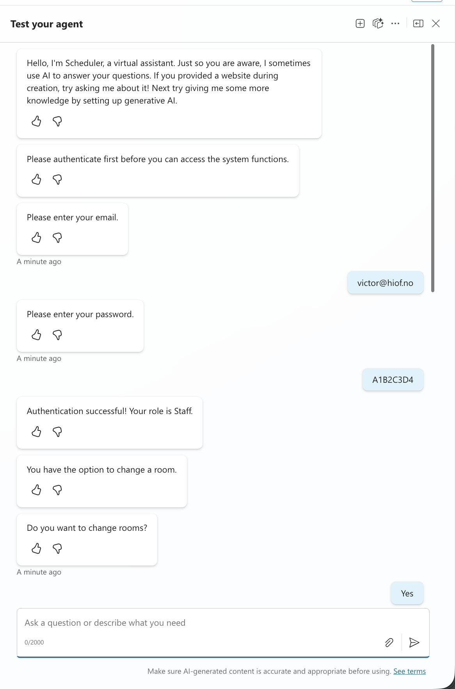
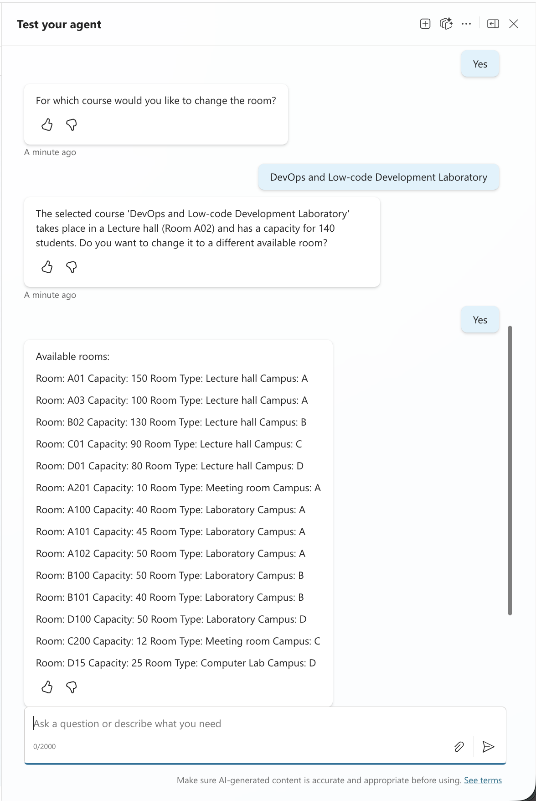
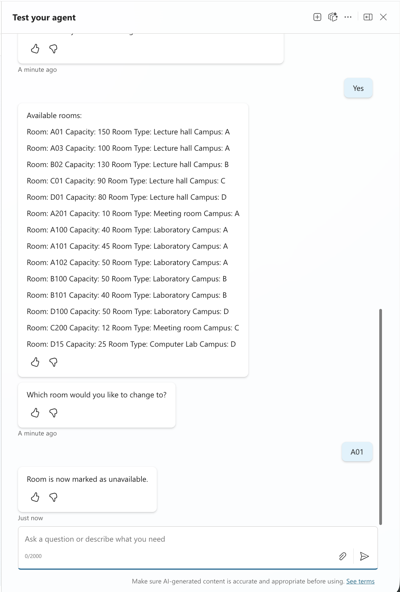
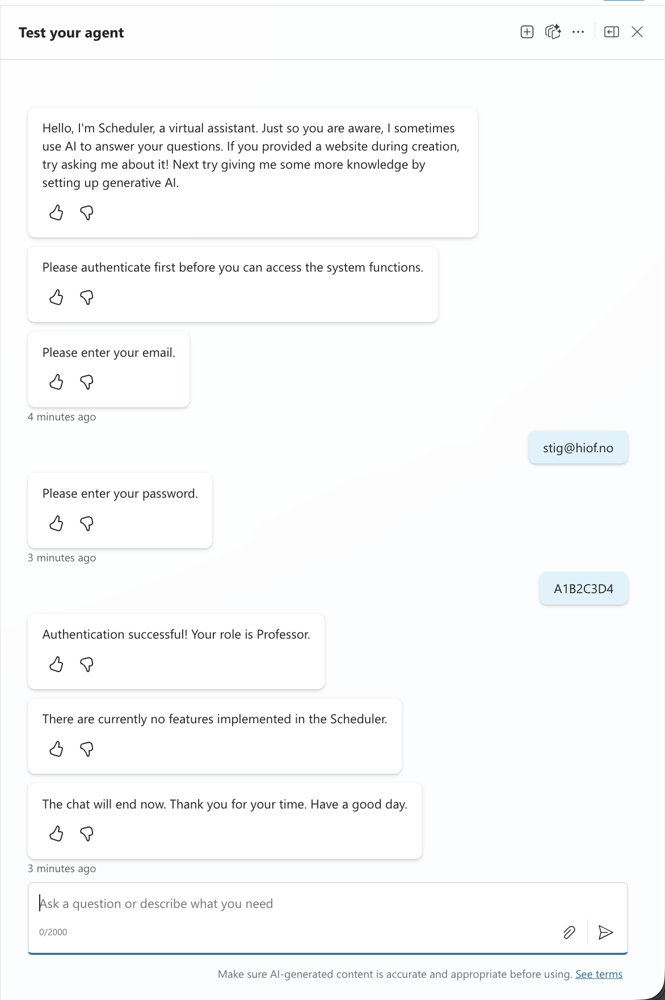
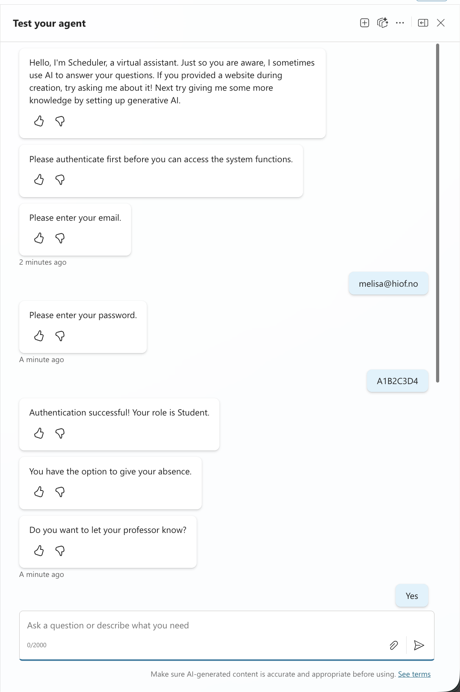
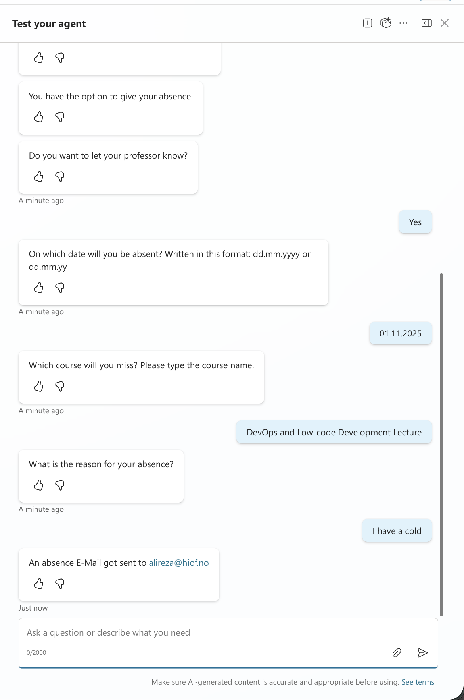

Link to our Copilot Agent: https://web.powerva.microsoft.com/environments/6484ef4a-54a6-e8b2-81c8-a24f9f8b1849/bots/bba1bea3-41ba-f011-bbd3-6045bda07122/overview

---

## Testing and Monitoring

### Automated Tests
We utilized Power Apps Test Studio to create automated test suites that cover critical user paths, role-based access, and data security integrity. This ensured the reliability of the application's core functionality, especially the dynamic timetable and the multi-role login process.

#### Test Suites and Case Descriptions
We grouped our test cases into three primary suites focused on authentication, security, and the main cancellation workflow.

| Test Suite Name | Test Case Name | Validation Purpose | Issues Identified |
|-----------------|----------------|--------------------|-------------------|
| ScheduleApp | loginAsStudent | Validates successful login and navigation for the Student role. | None |
| ScheduleApp | loginAsProf | Validates successful login and navigation for the Professor role. | None |
| ScheduleApp | loginAsStaff | Validates successful login and navigation for the Staff role. | None | 
| ScheduleApp | loginWithWrongEmail | Validates that the system correctly rejects login attempts using an invalid email format or non-existent account. | None |
| ScheduleApp | loginWithWrongPassword | Validates that the system correctly rejects login attempts with a valid email but incorrect password. | None |
| ScheduleApp | loginWithEmptyLabels | Validates that the system handles empty input fields gracefully (e.g., preventing login). | None |
| ScheduleApp | logout | Validates that users (Student/Staff) can successfully navigate to the profile screen and terminate their session. | None |
| ScheduleApp | cancelClassAsProf | Validates the Professor's core workflow: successful login, navigation to profile, and toggling the course selection menu. | Critical Bug Identified: Test Studio failed because it could not specify the correct ThisItem context to select the btnSelectCourse inside the nested gallery, leading to a selection error and test failure becuase of Test Studio limitations. | 
| ScheduleApp | notification | Validates the user's ability to navigate to the profile screen and manually trigger the notification pop-up state. | Limitation Observed: Although the logic worked, the test failed to visually validate the pop-up visibility because Test Studio cannot simulate the necessary context switch required for the varShowPopup property to render the element. |

#### Summary of Testing Usage
We used Test Studio to simulate user actions (SetProperty, Select, Maps) to verify that the core application functions (authentication, role-based access to the profile screen) executed successfully.

The testing process successfully identified a critical scope bug in the cancellation workflow (cancelClassAsProf failed at step 6). This bug was traced to an inability to select the button inside the course list gallery, highlighting a selection hierarchy or ordering issue that requires code review.

---

### Monitoring and Performance
We utilized the Power Platform Monitor tool to analyze network calls, data operations, and function execution times within the application. This provided visibility into the flow of data during critical user journeys, such as login and course data loading.

The live monitoring is visible in our GitHub repo (e.g., under `../assets/Assignment4/Tests/LiveMonitoring`).

#### Metrics 
We primarily reviewed the following metrics to assess performance and data handling during each transaction:
- Network Calls (Dataverse getRows): Monitored the time taken for the application to fetch data from the People, Enrollments, and Courses tables.
- Data Operations (patchRow): Tracked the success and latency of the Patch operation used to update the 'Logged in?' status in the People table during login and the status of the course upon sign-out.
-Function Execution Time (ClearCollect, Filter): Reviewed the time required for Power Fx functions to execute, especially those building and filtering the necessary collections (colUserEnrollments, colUserCourses, etc.).

#### Bottlenecks and Resolutions
Across all tested scenarios (successful login, sign-out, and failure conditions), we did not observe any decisive performance issues or extreme network latency that required immediate refactoring. The system performed its synchronous tasks (like fetching rows and updating patches) within acceptable limits for the small dataset used.
- Improvement: We did not implement any specific performance improvements or refactorings based on Monitor insights, as no decisive bottlenecks were found. The existing complex filter logic (using multiple ClearCollect actions) proved adequately fast for the current application scope.

#### Test Suites and Cases Reviewed in Monitor
| Test Suite | Case Name Reviewed | Primary Operations Tracked |
|------------|--------------------|----------------------------|
| ScheduleApp | loginAsStudent | getRows (People, Enrollments, Courses) and ClearCollect functions. |
| ScheduleApp | loginAsProf | getRows and ClearCollect for professor data and courses. |
| ScheduleApp | loginAsStaff | getRows and ClearCollect for staff data and courses. |
| ScheduleApp | loginWithWrongPassword | getRows (People) to confirm the filter executes quickly even with mismatched credentials. |
| ScheduleApp | cancelClassAsProf | Network Run call to the Cancel_Course_Notification Power Automate flow. |
| ScheduleApp | logout | patchRow and Clear functions (clearing collections) upon sign-out. |

The tests are visible in our GitHub repo (e.g., under `/solutions/<SolutionName>/CanvasApps/.../Tests/` and `../assets/Assignment4/Tests/TestStudio`).

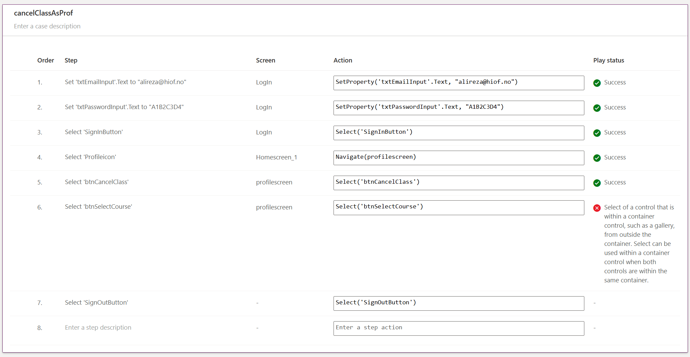
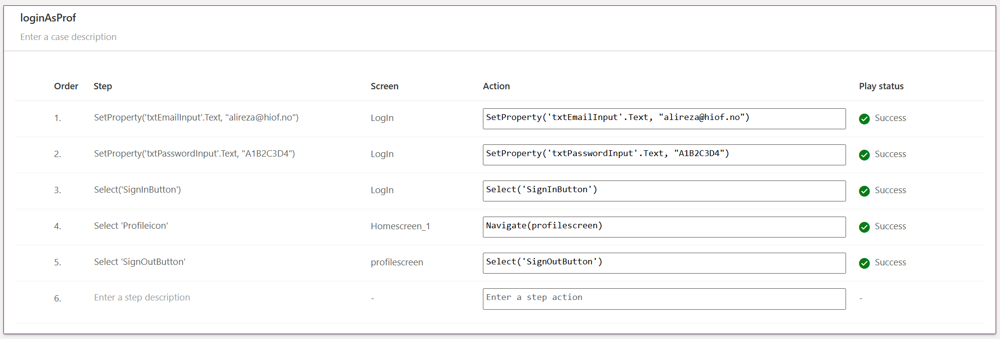
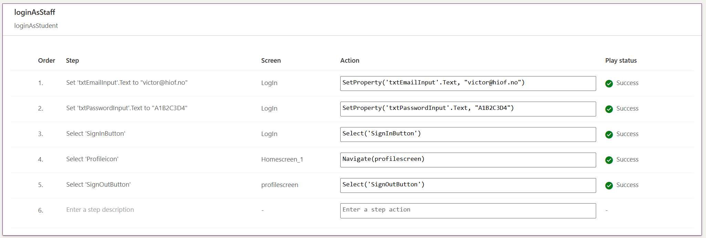
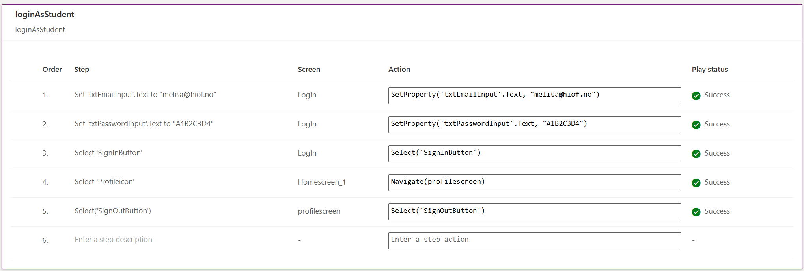
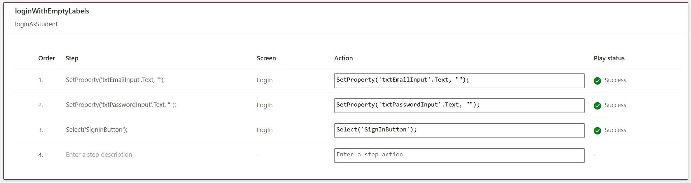
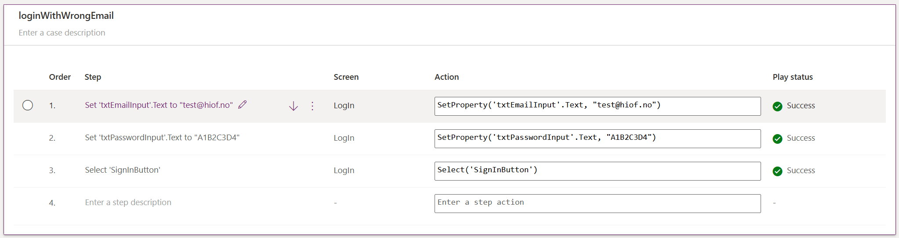
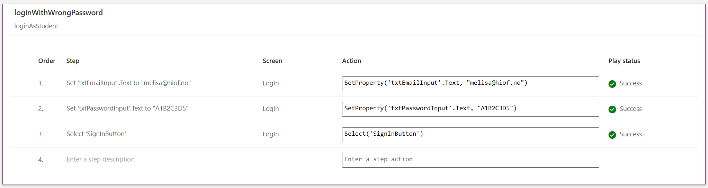
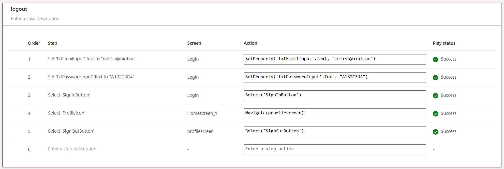
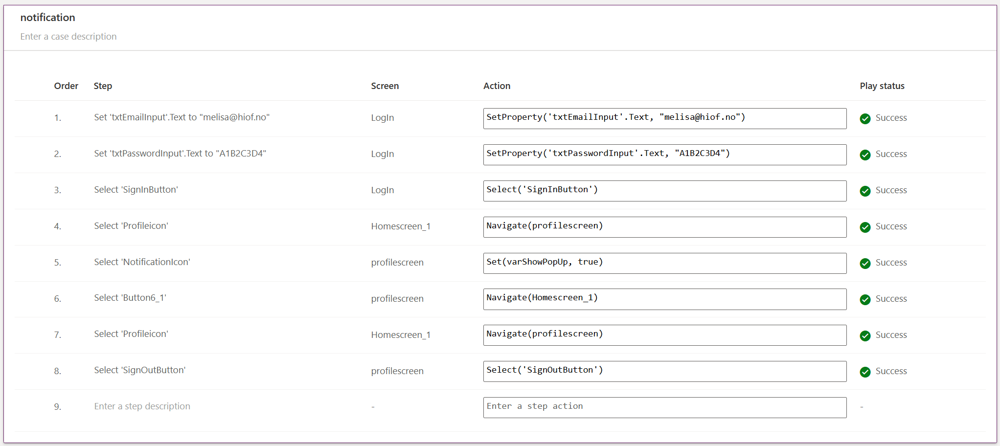
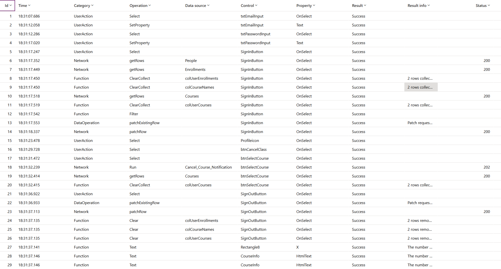
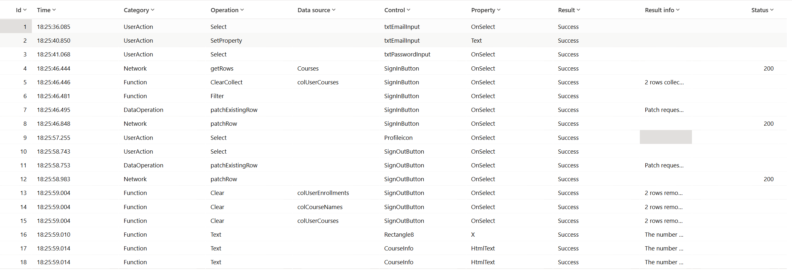
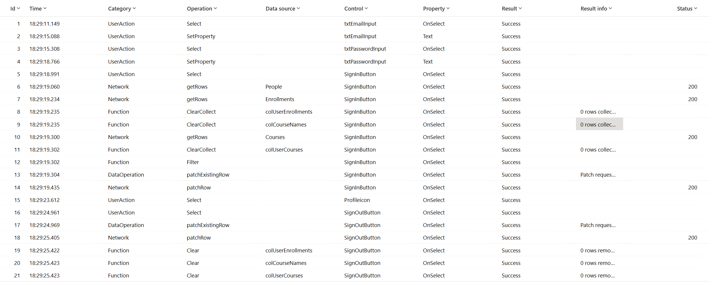
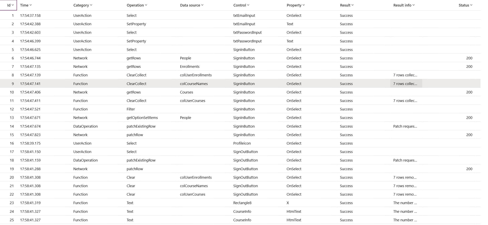
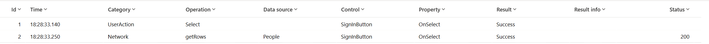
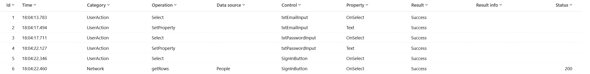
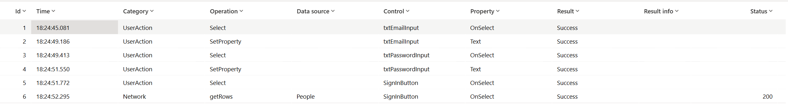
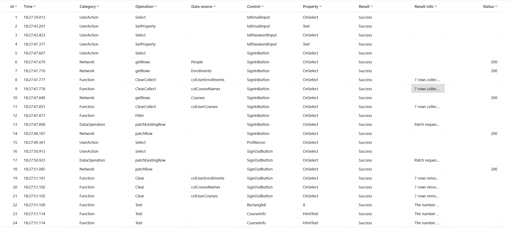
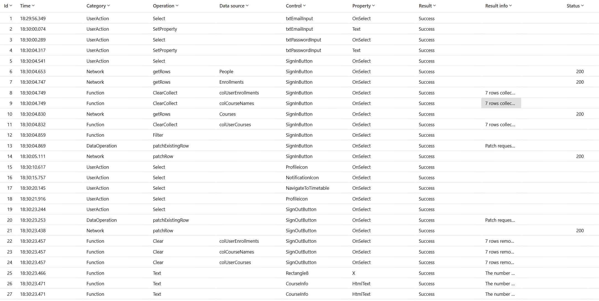

---

## Final Version Deployment to Production

### Deployment Process
#### Pipeline Stages and Deployment Steps
Our deployment adhered to the established three-stage Application Lifecycle Management (ALM) process: Development --> Testing --> Production.

1. Deployment from Development to Testing:
- Action: The maker initiated the deployment from the Development environment (Melisa Avci's Environment) by selecting the solution and choosing the Testing stage as the target.
- Purpose: This deployed the solution as a Managed Solution for User Acceptance Testing (UAT).
- Status Verification: The Pipeline Run screenshot ([Figure 26: The app in the production environment](../assets/Assignment4/PipelineRun.png)) would show the successful completion of this initial stage, verifying that the artifact moved correctly.

2. Deployment from Testing to Production:
- Action: After successful validation in the Testing environment (e.g., verifying that the authentication and scheduling logic performed as expected), the maker initiated the final deployment. This deployment was triggered by selecting "Deploy here" on the Production stage tile.
- Purpose: This moved the final, approved version of the solution (which should function identically to the tested version) to the live environment for end-user access.
[Figure 26: The app in the production environment](../assets/Assignment4/PipelineRun.png)

#### Verification of Final Version
The final version of the application was verified to function as intended after deployment to the Production environment. The App in Production screenshot ([Figure 26: The app in the production environment](../assets/Assignment4/PipelineRun.png)) would serve as evidence that the application loaded correctly and that the core user interfaces (like the login screen or the main timetable) were accessible in the live environment.

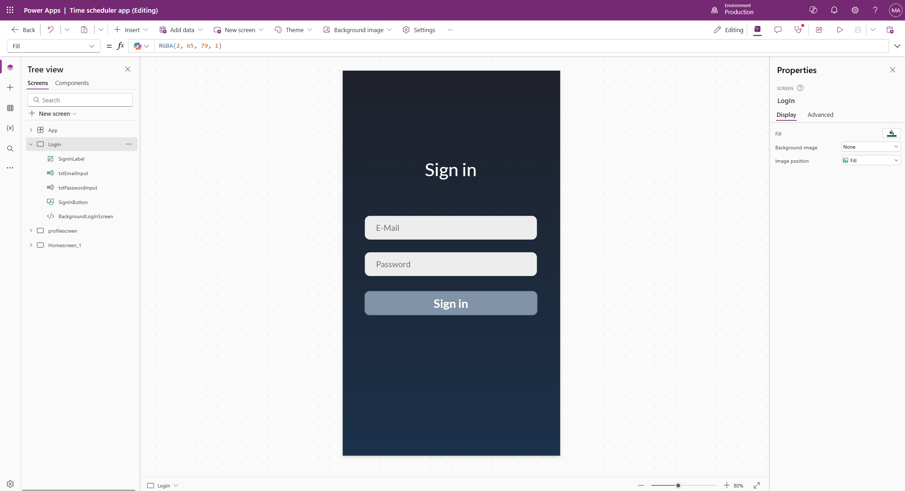
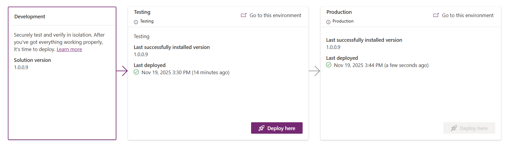

---

## Reflection

### Reflection and Learning
#### Copilot Integration: Impact on Functionality and User Experience
Integrating the Copilot fundamentally shifted the application's functionality from a passive data viewer to an active, role-gated transaction handler.
- Functionality: The Copilot automated critical administrative communication (Student Absence Reporting) and resource management (Staff Room Change), tasks which previously required manual email drafting or direct data entry. This transformed complex, multi-step processes into simple, natural language interactions.
- User Experience (UX): The Copilot provided a personalized UX by immediately authenticating the user and restricting available topics based on the Bot.UserRole (Student, Staff). This meant users were never shown irrelevant options, improving efficiency.
- Key Restriction: A major technical obstacle was the institutional inability to publish the bot, preventing direct integration with the live Power App. This forced us to rely on a workaround (a manual login prompt within the bot and external website link) that complicated the initial user flow, demonstrating a constraint on out-of-the-box integration capabilities.

#### Lessons Learned from Testing and Monitoring
The testing phase was highly valuable, not for revealing major performance flaws (as Monitor showed no decisive bottlenecks), but for identifying platform-specific limitations:
- Power Apps Test Studio Limitations: We learned that Test Studio struggles with advanced UI constructs. Specifically, we were unable to reliably test interactions involving nested galleries (failing to select ThisItem buttons) and conditional invisible pop-ups. This highlighted a gap in the automated testing suite for complex low-code interfaces.
- Tooling and Development Friction: We identified that the Copilot Studio editor lacks native features for easily handling date-to-string conversion, requiring cumbersome Power Fx workarounds (e.g., using FormatDateTime). Furthermore, the co-authoring environment was restrictive, as collaboration was automatically terminated when one co-owner entered the testing studio, interrupting teamwork.

#### Contribution to the DevOps Lifecycle
Our integrated DevOps strategy leveraged both automated deployment tools and the Copilot agent to contribute across all phases of the lifecycle:
- Build Phase: The development process was formalized by committing and pushing the solution to Azure DevOps and GitHub before any deployment, establishing source control and traceability for the application components.
- Release & Deploy Phase: Automated deployment contributed significantly here by utilizing the Power Platform pipeline to systematically move the final version from Development --> Test --> Production.
- Test Phase: Testing was integrated into the cycle by using the pipeline to enforce the testing phase, ensuring the solution only proceeded to the next environment upon successful verification.
- Operate Phase (Automated Rollback & AI Support):
  - Automated Deployment facilitates the Operate phase by allowing for quick rollback to the previous stable version if a post-deployment issue is discovered through the automated pipeline framework.
  - AI Integration also contributes to the Operate phase by assisting the user with natural-language interaction, automating tasks, and providing intelligent insights based on the app’s data.
- Plan & Code / Monitor Phases (AI Contribution): AI integration contributes to the Plan & Code phase by providing usage patterns and interactions from the Copilot that can generate valuable data. It also contributes to the Monitor phase when the Copilot design is leveraged to provide “intelligent insights” based on performance or usage data.

